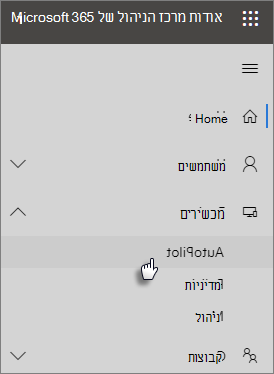

# שימוש במדריך שלב אחר שלב להוספת מכשירים ופרופיל של Autopilot

באפשרותך להשתמש ב-Windows בטייס אוטומטי כדי להגדיר מכשירים **חדשים** של windows 10 עבור העסק שלך, כך שהם יהיו מוכנים לשימוש כאשר אתה מעניק אותם לעובדים שלך.
  
## דרישות המכשירים

המכשירים חייבים לעמוד בדרישות אלה:
  
- Windows 10, גירסה 1703 ואילך
    
- מכשירים חדשים שאינם מותקנים בחוויית Windows out-of-box
    
## שימוש במדריך ההתקנה ליצירת מכשירים ופרופילים

אם עדיין לא יצרת קבוצות מכשירים או פרופילים, הדרך הטובה ביותר להתחיל היא באמצעות מדריך שלב אחר שלב. באפשרותך גם [להוסיף מכשירים](create-and-edit-autopilot-devices.md) ולהקצות להם [פרופילים](create-and-edit-autopilot-profiles.md) ללא שימוש במדריך. 
  
1. עבור אל מרכז הניהול ב <a href="https://go.microsoft.com/fwlink/p/?linkid=837890" target="_blank">https://admin.microsoft.com</a> -.

2. בחלונית הניווט הימנית, בחר **מכשירים** \> **טייס אוטומטי**.

    
  
2. בדף **הטייס האוטומטי** , לחץ או הקש על **התחל מדריך**.
    
    
  
3. בדף **העלאת קובץ. csv עם רשימת מכשירים** , אתר את המיקום שבו אתה מוכן. קובץ CSV ולאחר מכן **פתח את** \> **הבא**. הקובץ חייב לכלול שלוש כותרות:
    
    - עמודה א: מספר סידורי של המכשיר
    
    - עמודה ב: מזהה המוצר של Windows
    
    - עמודה ג: קוד Hash של החומרה
    
    באפשרותך לקבל מידע זה מספק החומרה, או להשתמש [בסקריפט get-Windowsautopilotinfohttps PowerShell](https://www.powershellgallery.com/packages/Get-WindowsAutoPilotInfo) כדי ליצור קובץ CSV. 
    
    למידע נוסף, ראה [קובץ CSV עם רשימת מכשירים](https://docs.microsoft.com/microsoft-365/admin/misc/device-list). באפשרותך גם להוריד קובץ לדוגמה בדף **העלאת קובץ ‎.csv עם רשימת מכשירים**. 
    
> [!NOTE]
> קובץ script זה משתמש ב-WMI כדי לאחזר מאפיינים הדרושים עבור לקוח כדי לרשום מכשיר באמצעות הטייס האוטומטי של Windows. שים לב שהוא נורמלי עבור קובץ ה-CSV שנוצר כדי לא לאסוף ערך של מזהה מוצר של Windows (PKID) מאחר שאין צורך לרשום מכשיר וPKID להיות NULL ב-CSV של הפלט הוא בסדר גמור. רק המספר הסידורי וגיבוב החומרה יאוכלסו.
    
4. בדף **הקצאת פרופיל** , באפשרותך לבחור פרופיל קיים או ליצור פרופיל חדש. אם עדיין אין לך אחד, תתבקש ליצור אחד. 
    
    פרופיל הוא אוסף הגדרות שניתן להחיל על מכשיר בודד או על קבוצה של מכשירים.
    
    תכונות ברירת המחדל נדרשות ומוגדרות באופן אוטומטי. תכונות ברירת המחדל הן:
    
    - דלג על Cortana, OneDrive ורישום OEM.
    
    - יצירת חוויית כניסה עם מותג החברה.
    
    - חבר את המכשירים שלך לחשבונות התכלת של Active Directory ורשום אותם באופן אוטומטי כדי לנהל אותם על-ידי Microsoft 365 Business Premium.
    
    לקבלת מידע נוסף, ראה [אודות הגדרות פרופיל טייס אוטומטי](autopilot-profile-settings.md). 
    
5. שאר ההגדרות הן **דלג על הגדרות פרטיות** ו **אל תאפשר למשתמש להפוך למנהל המערכת המקומי**. שתי הגדרות אלה מוגדרות למצב **כבוי** כברירת מחדל. 
    
    בחר **הבא**.
    
6. **סיימת** מציינת שהפרופיל שיצרת (או שבחרת) יוחל על קבוצת ההתקנים שיצרת על-ידי העלאת רשימת המכשירים. ההגדרות ייכנסו לתוקף כאשר משתמשי המכשיר ייכנסו לשלב הבא. בחר **סגור**.
    
