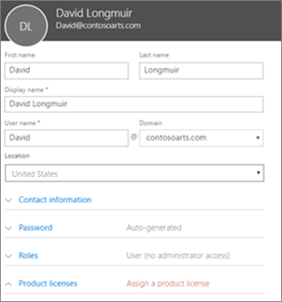
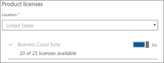

# הוספת משתמשים נוספים ל-Microsoft 365 Business

## הוספת משתמשים חדשים

צפה בסרטון וידאו קצר אודות הוספת משתמש.   

> [!VIDEO https://www.microsoft.com/videoplayer/embed/RE1FOfN] 

אם סרטון וידאו זה היה שימושי עבורך, עיין ב[סדרת ההדרכה המלאה עבור עסקים קטנים ומשתמשים חדשים ב- Microsoft 365](https://support.office.com/article/6ab4bbcd-79cf-4000-a0bd-d42ce4d12816).

כדי להוסיף משתמש:

1. <a href="https://go.microsoft.com/fwlink/p/?linkid=837890" target="_blank">https://admin.microsoft.com</a>. לך למרכז המנהלה 
2. בחלונית הניווט השמאלית, **בחר** \> באפשרות משתמשים **פעילים**.
3. בדף ' **משתמשים פעילים** ', בחר **באפשרות ' הוסף משתמש**'.
4. בחלונית **המשתמש החדשה** , הקלד את המידע הדרוש. 
  
    באפשרותך להזין מידע נוסף תחת **פרטי קשר**, לבחור כיצד תגדיר את הסיסמה תחת הגדרת **סיסמה** ולהקצות תפקידים תחת **תפקידים**.
      
    
      
    **במקטע**רשיונות מוצר, הגדר את הגדרת רשיון המוצר **העסקי של Microsoft 365** .
      
    
  
לקבלת מידע נוסף אודות הוספת משתמשים, ראה [הוספת משתמשים בנפרד או בצובר](https://docs.microsoft.com/office365/admin/add-users/add-users).
  
