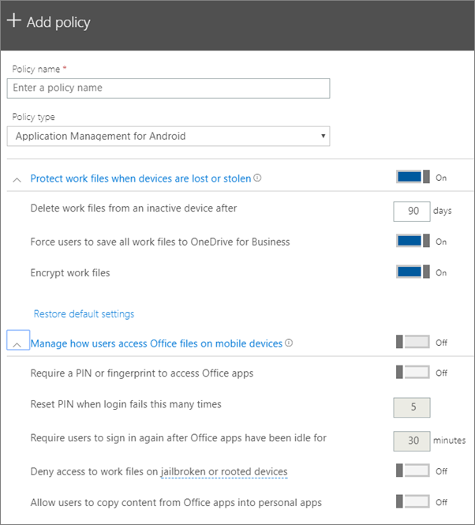

# קביעת הגדרות הגנה של אפליקציות עבור מכשירי Android או iOS

## יצירת מדיניות לניהול יישומים

1. . לך למרכז המנהלה https://admin.microsoft.com 
    
2. בניווט השמאלי, בחר **Devices** באפשרות \> **מדיניות** התקנים \> **Add**.
  
3. בחלונית **הוסף מדיניות**, הזן שם ייחודי עבור מדיניות זו. 
    
4. תחת **סוג מדיניות**, בחר באפשרות **ניהול יישומים עבור אנדרואיד** או **ניהול יישומים עבור iOS**, בהתאם לקבוצת פריטי המדיניות שברצונך ליצור. 
    
5. הרחב **הגנה על קבצי עבודה כאשר התקנים אובדים או גנובים** **ומנהלים כיצד משתמשים ניגשים לקבצי Office בהתקנים ניידים**. הגדר את ההגדרות כיצד ברצונך. **נהל את האופן שבו משתמשים ניגשים לקבצי Office במכשירים ניידים** **מבוטלת** כברירת מחדל, אך מומלץ להפעיל **אותו ולקבל** את ערכי ברירת המחדל. לקבלת מידע נוסף, ראה [הגדרות זמינות](#available-settings). 
    
    ניתן להשתמש תמיד בקישור **איפוס הגדרות ברירת מחדל** כדי לחזור להגדרת ברירת המחדל. 
    
    
  
6. לאחר מכן החלט **מי יקבל הגדרות אלה?** אם אין ברצונך להשתמש בקבוצת האבטחה ' **כל המשתמשים** ' המהווה ברירת מחדל, בחר באפשרות ' **שינוי**', בחר בקבוצות האבטחה הבאות \> **לבחירת**הגדרות אלה.
    
7. לבסוף, בחר **סיום** כדי לשמור את המדיניות והקצה אותה למכשירים. 
    
## עריכת מדיניות לניהול יישומים

1. בכרטיס **המדיניות** , בחר **מדיניות עריכה**.
    
2. בחלונית **ערוך מדיניות**, בחר את המדיניות שברצונך לשנות 
    
3. בחר **ערוך** לצד כל הגדרה כדי לשנות את הערכים במדיניות. בעת שינוי ערך, הוא נשמר באופן אוטומטי במדיניות.
    
4. לאחר שתסיים, סגור את חלונית **המדיניות ' עריכת** '. 
    
## מחיקת מדיניות לניהול יישומים

1. בדף ' **פריטי מדיניות** ', בחר מדיניות ולאחר מכן **מחק**.
    
2. בחלונית **המדיניות Delete** , בחר באפשרות **אישור** כדי למחוק את המדיניות או את פריטי המדיניות שבחרת. 
    
## הגדרות זמינות

הטבלאות הבאות מאפשרות מידע מפורט אודות הגדרות הזמינות להגנה על קבצי עבודה בהתקנים ועל ההגדרות השולטות באופן שבו משתמשים ניגשים לקבצי Office מההתקנים הניידים שלהם.
  
 לקבלת מידע נוסף, ראה [כיצד ניתן להגן על תכונות ההגנה ב-Microsoft 365 Business Premium ממפה להגדרות Intune](map-protection-features-to-intune-settings.md). 
  
### הגדרות להגנה על קבצי עבודה

ההגדרות הבאות זמינות כדי להגן על קבצי עבודה במקרה אובדן או גניבה של מכשיר משתמש:
  
|||
|:-----|:-----|
|הגדרה    |תיאור    |
|מחק קבצי עבודה ממכשיר לא פעיל לאחר מספר הימים הבא    |אם התקן אינו משמש למספר הימים שתציין כאן, כל קבצי העבודה המאוחסנים בהתקן יימחקו באופן אוטומטי.    |
|אלץ משתמשים לשמור את כל קבצי העבודה ב- OneDrive for Business    |אם הגדרה זו **מופעלת**, מיקום השמירה היחיד הזמין עבור קבצי עבודה הוא Onedrive עבור Business.    |
|הצפן קבצי עבודה    |השאר הגדרה זו במצב **פעיל** כך שקבצי העבודה יהיו מוגנים על-ידי הצפנה. גם אם ההתקן אובד או נגנב, אף אחד לא יכול לקרוא את נתוני החברה שלך.    |
   
### הגדרות שקובעות כיצד משתמשים ניגשים לקבצי Office במכשירים ניידים

ההגדרות הבאות זמינות לניהול אופן הגישה של משתמשים לקבצי עבודה של Office:
  
|||
|:-----|:-----|
|הגדרה    |תיאור    |
|דרוש מספר זיהוי אישי או טביעת אצבע כדי לגשת ליישומי Office    |אם הגדרה זו נמצאת **על** משתמשים חייבת לספק צורה אחרת של אימות, בנוסף לשם המשתמש והסיסמה שלהם, לפני שהם יוכלו להשתמש ביישומי Office במכשירים הניידים שלהם.  |
|אפס מספר זיהוי אישי כשהכניסה נכשלת מספר פעמים זה    |כדי למנוע ממשתמש לא מורשה לנחש באופן אקראי קוד PIN, הקוד יאופס לאחר מספר כניסות שגויות שאתה תציין.    |
|דרוש מהמשתמשים להיכנס שוב לאחר שיישומי Office היו לא פעילים במשך    |הגדרה זו קובעת כמה זמן יכול המשתמש להיות לא פעיל לפני שתתבקש להיכנס שוב.    |
|מנע גישה לקבצי עבודה במכשירים שנפרצו או שבוצעה בהם פעולת ROOT    |ייתכן מצב שבו משתמשים מתוחכמים יחזיקו במכשיר שנפרץ או שבוצעה בו פעולת ROOT. כלומר, המשתמש יכול לשנות את מערכת ההפעלה, עובדה שחושפת את המכשיר לתוכנות זדוניות. מכשירים אלה נחסמים כאשר ההגדרה מוגדרת למצב **פעיל**.    |
|אל תאפשר למשתמשים להעתיק תוכן מיישומי Office ליישומים אישיים    |אנחנו מאפשרים זאת כברירת מחדל, אך אם ההגדרה **מופעלת**, המשתמש יכול להעתיק מידע בקובץ עבודה לקובץ אישי. אם ההגדרה **מבוטלת**, למשתמש אין אפשרות להעתיק מידע מקובץ עבודה לאפליקציה אישית או לחשבון אישי.    |
