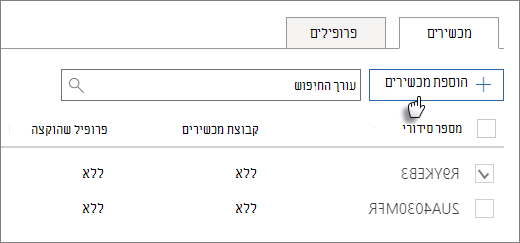

# יצירה ועריכה של מכשירי AutoPilot

## העלאת רשימה של מכשירים

באפשרותך להשתמש במדריך [שלב אחר שלב להעלאת](add-autopilot-devices-and-profile.md) מכשירים, אך באפשרותך גם להעלות מכשירים **בכרטיסיה מכשירים.** 
  
מכשירים חייבים לעמוד בדרישות הבאות:
  
- Windows 10, גירסה 1703 ואילך
    
- מכשירים חדשים שלא עברו Windows חוויה מחוץ לקופסה

1. בתיבת מרכז הניהול של Microsoft 365, בחר  \> **מכשירים AutoPilot**.
  
2. בדף **AutoPilot,** בחר בכרטיסיה **מכשירים** \> **הוסף מכשירים**.
    
    
  
3. בלוח הוספת **מכשירים,** עבור אל קובץ [CSV של רשימת ההתקנים](../admin/misc/device-list.md) שהכנת \> **שמור** \> **סגור**.
    
    באפשרותך לקבל מידע זה מספק החומרה שלך, או להשתמש בקובץ [ה- Script Get-WindowsAutoPilotInfo PowerShell](https://www.powershellgallery.com/packages/Get-WindowsAutoPilotInfo) כדי ליצור קובץ CSV. 
    
## הקצאת פרופיל למכשיר או לקבוצה של מכשירים

1. בדף **הכנת Windows,** בחר בכרטיסיה **מכשירים** ובחר את תיבת הסימון לצד מכשיר אחד או יותר. 
    
2. בלוח **מכשיר**, בחר פרופיל מהתפריט הנפתח **פרופיל שהוקצה**. 
    
    אם עדיין אין לך פרופילים, ראה [יצירה ועריכה של פרופילי AutoPilot](create-and-edit-autopilot-profiles.md) לקבלת הוראות. 
