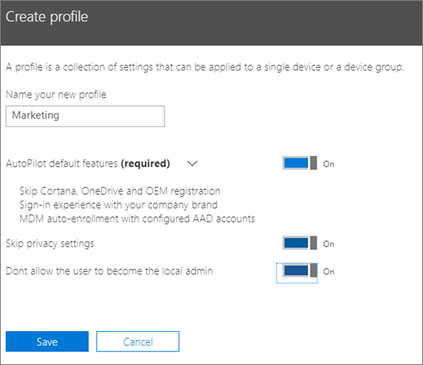
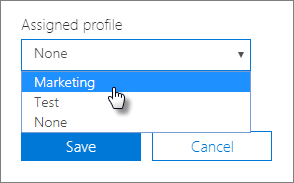

# יצירה ועריכה של פרופילי AutoPilot

## יצירת פרופיל

פרופיל חל על מכשיר או על קבוצה של מכשירים
  
1. במרכז הניהול העסקי של Microsoft 365, בחר **התקנים** \> **טייס אוטומטי**.
  
2. בעמוד **הטייס האוטומטי** , **** בחר בכרטיסיה \> פרופילים **צור פרופיל**.
    
3. בדף **יצירת פרופיל** , הזן שם עבור הפרופיל שמסייע לך לזהות אותו, לדוגמה שיווק. הפעל את ההגדרה הרצויה ולאחר מכן בחר **בשמור**. לקבלת מידע נוסף אודות הגדרות פרופיל טייס אוטומטי, ראה [אודות הגדרות פרופיל טייס אוטומטי](autopilot-profile-settings.md).
    
    
  
### החלת פרופיל על מכשיר

לאחר יצירת פרופיל, באפשרותך להחילו על התקן או על קבוצת התקנים. באפשרותך לבחור פרופיל קיים [במדריך שלב-אחר-שלב](add-autopilot-devices-and-profile.md) ולהחילו על התקנים חדשים, או להחליף פרופיל קיים עבור התקן או קבוצת התקנים. 
  
1. בדף **הכנת Windows**, בחר בכרטיסיה **מכשירים**. 
    
2. בחר בתיבת הסימון שליד שם התקן, ובחלונית **ההתקן** , בחר פרופיל \> מהרשימה הנפתחת **פרופיל שהוקצה** **שמור**.
    
    
  
## עריכה, מחיקה או הסרה של פרופיל

לאחר שהקצית פרופיל למכשיר, תוכל לעדכן אותו גם אם כבר נתת את המכשיר למשתמש. כאשר המכשיר יתחבר לאינטרנט, הוא יוריד את הגירסה העדכנית ביותר של הפרופיל שלך במהלך תהליך ההתקנה. אם המשתמש משחזר את המכשיר שלו את להגדרות ברירת המחדל של היצרן, המכשיר יוריד שוב את העדכונים האחרונים לפרופיל שלך. 
  
### עריכת פרופיל

1. בדף **הכנת Windows**, בחר בכרטיסיה **פרופילים**. 
    
2. בחר בתיבת הסימון לצד שם התקן, ובחלונית **הפרופיל** , עדכן כל אחת מההגדרות \> הזמינות **שמור**.
    
    אם תבצע פעולות אלה לפני שהמשתמש יחבר את המכשיר לאינטרנט, הפרופיל יוחל על תהליך ההתקנה.
    
### מחיקת פרופיל

1. בדף **הכנת Windows**, בחר בכרטיסיה **פרופילים**. 
    
2. בחרו בתיבת הסימון שליד שם התקן, ובחלונית ' **פרופיל** ', בחרו ' **מחק** \> **שמור**פרופיל '.
    
    כאשר תמחק פרופיל, הוא יוסר מהכשיר או מקבוצת המכשירים שלהם הוא הוקצה.
    
### הסרת פרופיל

1. בדף **הכנת Windows**, בחר בכרטיסיה **מכשירים**. 
    
2. בחר בתיבת הסימון שליד שם התקן, ובחלונית **ההתקן** , בחר **בללא** מתוך \> **הרשימה**הנפתחת **פרופיל שהוקצתה** .
    
