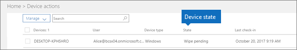

# מצבי המכשיר

מכשירים ברשימה **פעולות מכשיר** (דף הבית של הניהול \> **פעולות מכשיר**) יכולים לכלול את המצבים הבאים.
  

  
|**מצב**|**תיאור**|
|:-----|:-----|
|מנוהל על-ידי Intune    |מנוהל על-ידי Microsoft 365 Business.    |
|בהמתנה להוצאה משימוש    |Microsoft 365 Business מתכונן להסרת נתוני החברה מהמכשיר.    |
|הוצאה משימוש מתבצעת    |Microsoft 365 Business מסיר כעת את נתוני החברה מהמכשיר.    |
|הוצאה משימוש נכשלה    | פעולת הסרת נתוני החברה נכשלה.    |
|פרישה בוטלה    |פעולת הפרישה בוטלה.    |
|בהמתנה למחיקה    |ממתין להתחלת איפוס להדגרות היצרן.    |
|מחיקה מתבצעת    |בוצע איפוס להגדרות היצרן.    |
|מחיקה נכשלה    |. לא יכולתי לבצע איפוס של המפעל    |
|ניגוב בוטל    |. מחיקת המפעל בוטלה    |
|לא תקין    |פעולה ממתינה (או בעיצומה), אך ההתקן לא נרשם במשך 30 + ימים.    |
|בהמתנה למחיקה    |פעולת המחיקה ממתינה.    |
|התגלה    |Microsoft 365 Business זיהה את המכשיר.    |
   
