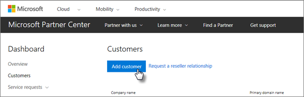
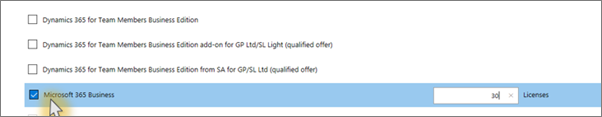

# קבל את Microsoft 365 Business Premium

## קבל את Microsoft 365 Business Premium מ-Microsoft

אם אין לך שותף וברצונך לקבל את Microsoft 365 Business Premium, באפשרותך [לקנות אותו כאן](https://www.microsoft.com/en-US/microsoft-365/business).

ראה [הרשמה לקבלת הוראות מפורטות עבור Microsoft 365 Business Premium](sign-up.md) .

באפשרותך גם לגשת [לחנות microsoft](https://www.microsoft.com/en-us/store/locations/find-a-store?icid=en_US_Store_UH_FAS) כדי לקנות את Microsoft 365 Business Premium ולקבל עזרה בנושא ההתקנה.
  
## קבל את Microsoft 365 Business Premium ממרכז השותפים של Microsoft

1. היכנס אל [מרכז השותפים של Microsoft](https://go.microsoft.com/fwlink/p/?linkid=849910) באמצעות האישורים שיצרת בעת הרישום לתוכנית ספק שירותי הענן (CSP). 
    
2. בלוח המחוונים של השותף, בחר **לקוחות** ולאחר מכן בחר את הלקוח שלך או הוסף לקוח חדש לפני שתקבל את Microsoft 365 Business Premium.
    
    
  
3. בדף **המנוי** של הלקוח, בחר **הוסף מנוי**, בחר את האפשרות עסקים קטנים תחת קטלוג ולאחר מכן בחר ב- **Microsoft 365 business Premium**.
    
    בחר את מספר הרשיונות הדרושים לך (עד 300). אם יש לך יותר מ- 300 משתמשים, ראה [Microsoft 365 Enterprise](../enterprise/index.yml) במקום זאת. 
    
    
  
    השלם את שאר השלבים להוספת לקוח חדש, כולל שם העסק.
