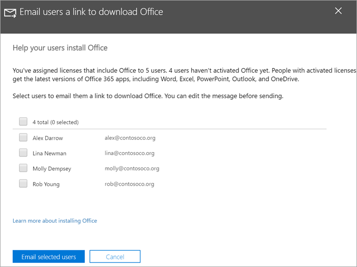

# עזרה למשתמשים להתקין את Office במכשירי Windows 10Help your users install Office on Windows 10 devices

באפשרותך להתקין במהירות ובקלות את Office במחשבי Windows 10 מתוך מרכז הניהול של Microsoft 365.You can quickly and easily install Office on Windows 10 PCs from the Microsoft 365 admin center.
  
כדי להבין כיצד זה עובד עם יישומי Office שהותקנו בעבר, קרא את [הכנה להתקנת לקוח של Office](prepare-for-office-client-deployment.md) לפני שתתחיל.To understand how this works with previously installed Office apps, read [Prepare for Office client installation](prepare-for-office-client-deployment.md) before you get started.

צפה בסרטון וידאו קצר אודות התקנת יישומי Office.Watch a short video about installing Office apps.  

> [!VIDEO https://www.microsoft.com/videoplayer/embed/acce002c-0756-4b64-ac5d-2198ee96a9b1] 

אם סרטון וידאו זה היה שימושי עבורך, עיין ב[סדרת ההדרכה המלאה עבור עסקים קטנים ומשתמשים חדשים ב- Microsoft 365](https://support.microsoft.com/office/6ab4bbcd-79cf-4000-a0bd-d42ce4d12816).If you found this video helpful, check out the [complete training series for small businesses and those new to Microsoft 365](https://support.microsoft.com/office/6ab4bbcd-79cf-4000-a0bd-d42ce4d12816).

## ניהול פריסות של OfficeManage Office deployments

1. עבור אל מרכז הניהול at <a href="https://go.microsoft.com/fwlink/p/?linkid=2024339" target="_blank">https://admin.microsoft.com</a> והיכנס באמצעות אישורי מנהל מערכת כללי.Go to the admin center at <a href="https://go.microsoft.com/fwlink/p/?linkid=2024339" target="_blank">https://admin.microsoft.com</a>, and sign in with global admin credentials. 

2. עבור אל **תוכנית ההתקנה** בחלונית הניווט הימנית, ובדף **ההגדרה** , גלול אל **יישומים ועדכונים**.Go to **Setup** in the left navigation pane, and on the **Setup** page, scroll to **Apps and updates**.
    > [!NOTE]
    > ייתכן שלא תראה כרטיס זה אם כל המשתמשים שלך התקינו יישומי Office.You might not see this card if all of your  users have installed Office apps.
  
3. בכרטיס **עזרה משתמשים להתקין את האפליקציות של Office** , בחר **תצוגה**ולאחר מכן **התחל**בעבודה.On the **Help users install their Office apps** card, choose **View**, and then **Get started**.
    
4. בקישור **משתמשי דואר אלקטרוני להורדת לוח Office** , בחר את המשתמשים שברצונך לשלוח בדואר אלקטרוני, ולאחר מכן **שלח דואר אלקטרוני למשתמשים שנבחרו**.On the **Email users a link to download Office** panel, select the users you want to email, and then **Email selected users**.

   

## לקבלת מידע נוסף אודות הגדרה ושימוש ב-Microsoft 365 Business PremiumFor more on setting up and using Microsoft 365 Business Premium

[סרטוני וידאו של הדרכה של Microsoft 365 for businessMicrosoft 365 for business training videos](https://support.microsoft.com/office/6ab4bbcd-79cf-4000-a0bd-d42ce4d12816)
