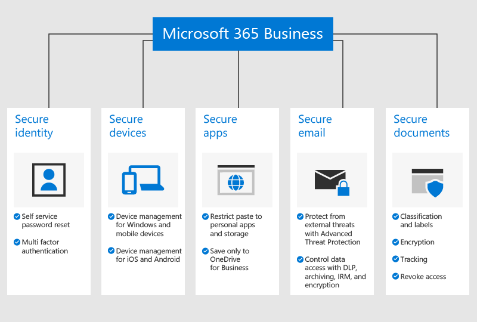

# מבט כולל על Microsoft 365 Business PremiumOverview of Microsoft 365 Business Premium

## מהו Microsoft 365 Business PremiumWhat is Microsoft 365 Business Premium

Microsoft 365 Business Premium (לשעבר Microsoft 365 Business) הוא שירות מקיף למנויים, המיועד לעסקים של עד 300 עובדים.Microsoft 365 Business Premium (formerly Microsoft 365 Business) is a comprehensive subscription service for businesses with less than 300 employees. הוא כולל את כל היישומים והשירותים של פרודוקטיביות ב- Office האהובים עליך, וכן כלים לשיתוף פעולה, כגון Microsoft Teams, עם יכולות אבטחה וניהול מכשירים מתקדמות.It integrates your favorite Office productivity apps and services, and collaboration tools like Microsoft Teams, with advanced security and device management capabilities.

## צפה: מהו Microsoft 365 Business PremiumWatch: What is Microsoft 365 Business Premium

> [!VIDEO https://www.microsoft.com/videoplayer/embed/RE2mhaA]

אם סרטון וידאו זה היה שימושי עבורך, עיין ב[סדרת ההדרכה המלאה עבור עסקים קטנים ומשתמשים חדשים ב- Microsoft 365](../business-video/index.yml).If you found this video helpful, check out the [complete training series for small businesses and those new to Microsoft 365](../business-video/index.yml).

Microsoft 365 Business Premium מיועד ל- 300 רשיונות לכל היותר.Microsoft 365 Business Premium is meant for up to 300 licenses. אם אתה זקוק לרשיונות נוספים, עיין בתיעוד של [Microsoft 365 Enterprise](../enterprise/index.yml) לקבלת מידע נוסף.If you need more licenses, see [Microsoft 365 Enterprise](../enterprise/index.yml) documentation for more information.

עיין ב[תיאור השירות של Microsoft 365 Business Premium](/office365/servicedescriptions/microsoft-365-service-descriptions/microsoft-365-business-service-description)לקבלת רשימת התכונות המלאה.See the [Microsoft 365 Business Premium service description](/office365/servicedescriptions/microsoft-365-service-descriptions/microsoft-365-business-service-description) for the entire list of features.

## צרכי האבטחה של העסקים הקטניםSmall business security needs

הנתונים העסקיים שלך עלולים להיחשף לסכנה בדרכים רבות.Your business data can be compromised in many ways. אתה והמשתמשים שלך עלולים לסכן את אבטחת הארגון כאשר אתם נכנסים באמצעות אישורים שנחשפו או מציגים נתונים ארגוניים במכשירים וביישומים שונים.You and your users can compromise your organization's security when you sign in with compromised credentials or view organization data on different devices and applications. באופן ספציפי יותר, הארגון שלך נמצא בסיכון מהגורמים הבאים:More specifically, your organization is at risk from:

- אישורי כניסה שנחשפו או אישורי כניסה חלשים.Compromised or weak sign-in credentials.
- מכשיר שנחשף לסכנה עם קוד PIN חלש, או מכשיר פרטי של משתמש.Compromised device with a weak pin, or a user owned device.
- משתמשים שיכולים להעתיק/להדביק/לשמור את הנתונים של הארגון שלך לתוך יישומים אישיים שלהם.Users who can copy/paste/save your organization's data to personal apps.
- משתמשים אשר מתקינים יישומים של ספקים חיצוניים בעלי אבטחה חלשה ומשתמשים בהם.Users who install and use third-party apps with weak security.
- נקודות תורפה בדואר אלקטרוני, כולל שיתוף נתונים רגישים, נסיונות דיוג, תוכנות זדוניות וכן הלאה.Email vulnerabilities, including sharing sensitive data, phishing attempts, malware, and so on.
- כאשר אנשים שאינם אמורים לעשות זאת, יכולים לגשת למסמכים בעלי מידע רגיש.When people who should not, can access documents with sensitive information.

Microsoft 365 Business Premium עוזר להגן על הנתונים שלך בכל אחד מהמקרים הללו.Microsoft 365 Business Premium helps safeguard your data in each of these instances. תכונות האבטחה שמגנות על הנתונים העסקיים שלך מפורטות באיור הבא.The security features that protect your business data are detailed in the following figure.

## כיצד הנתונים והמכשירים שלך מוגניםHow your data and devices are protected

Microsoft 365 Business Premium עוזר **להתגונן מפני איומים** על-ידי:Microsoft 365 Business Premium helps **defended against threats** by:

- סריקה בזמן אמת של קישורים בהודעות דואר אלקטרוני ובמסמכים כדי לחסום אתרי אינטרנט לא בטוחים (קישורים בטוחים).Scanning links in emails and documents in real time to block unsafe web sites (Safe Links).

- ביצוע ניתוח מתקדם של קבצים מצורפים לדואר אלקטרוני בסביבת ארגז חול כדי לזהות תוכנה זדונית חדשה (קישורים בטוחים).Performing advanced analysis of email attachments in a sandbox environment to detect newly developed malware (Safe Attachments).

- הפעלת פריטי מדיניות למניעת דיוג המשתמשים במודלים של למידת מכונה ובזיהוי התחזות כדי לספק הגנה מפני תקיפות מתקדמות (מניעת דיוג בבינת Defender עבור Office 365).Enabling anti-phishing policies that use machine learning models and impersonation detection to provide protection against advanced attacks (Anti-phishing in Defender for Office 365 intelligence).

- הגדרת פריטי מדיניות מתקדמים המבטלים את אפשרות הגישה ממיקומים לא מהימנים או עוקפים את הצורך באימות רב-גורמי ממקומות מהימנים, כגון רשת המשרד שלך (Azure MFA כולל כתובות IP מהימנות וגישה מותנית).Setting up advanced policies that disable access from untrusted locations or bypass multifactor authentication from trusted places such as your office network (Azure MFA including trusted IPs, and Conditional Access).

- אכיפת ההגנה מפני תוכנות זדוניות בכל מכשירי Windows 10 של הארגון שלך והגנה על קבצים בתיקיות מערכת מרכזיות מפני שינויים המבוצעים על-ידי תוכנות כופר (Windows Defender)Enforcing malware protection across all your organization's Windows 10 devices and protecting files in key system folders from changes made by ransomware (Windows Defender)

**הנתונים העסקיים שלך מוגנים** באמצעות:Your **business data is protected** by:

- שימוש בזיהוי אוטומטי כדי לסייע במניעת דליפה של מידע רגיש, כגון מספרי ביטוח לאומי או כרטיסי אשראי, אל מחוץ לעסק שלך (מניעת אובדן נתונים).Using automatic detection to help prevent sensitive information such as Social Security numbers or credit cards from leaking outside your business (data loss prevention).

- הצפנת הודעות דואר אלקטרוני רגישות כדי שתוכל לקיים תקשורת מאובטחת עם לקוחות או אנשים אחרים מחוץ לארגון שלך.Encrypting sensitive emails so you can communicate securely with customers or other people outside your organization. פעולה זו מבטיחה שרק הנמען המיועד יוכל לקרוא את ההודעה (הצפנת הודעות של Office 365).This ensures that only the intended recipient can read the message (Office 365 Message Encryption).

- שליטה בזהות המשתמשים בעלי גישה למידע של החברה על-ידי החלת מגבלות, כגון **לא להעתקה** ו **אל תעביר לנמענים** על דואר אלקטרוני ומסמכים (Azure Information Protection, תוכנית 1).Controlling who has access to company information by applying restrictions such as **Do Not Copy** and **Do Not Forward** to email and documents (Azure Information Protection, Plan 1).

- הפיכת אחסון בארכיון בענן לזמין באופן בלתי מוגבל כדי שתוכל לשמור על כל הדואר האלקטרוני של הארגון שלך, כולל תיבות דואר של עובדים לשעבר (אחסון בארכיון של Exchange Online).Enabling unlimited cloud archiving so you can retain all your organization's email, including the mailboxes of former employees (Exchange Online Archiving).

**המכשירים שלך מאובטחים** באמצעות:Your **devices are secured** by:

- קביעה אילו מכשירים ומשתמשים יוכלו לגשת לנתוני Microsoft שלך, עם אפשרויות לחסום כנחסת משתמשים ממחשבים ביתיים, מיישומים לא מאושרים או מחוץ לשעות העבודה (גישה מותנית).Controlling which devices and users can access your Microsoft data, with options to block users from signing in from home computers, unapproved apps, or outside of work hours (Conditional Access).

- החלת פריטי מדיניות של אבטחה כדי להגן על נתונים עסקיים במכשירי iOS ו- Android. לדוגמה, באפשרותך לדרוש מהמשתמשים לספק מספר זיהוי אישי או טביעת אצבע כדי לגשת לנתונים עסקיים ולהצפין נתונים במכשירים ניידים (הגנה על אפליקציות עבור אפליקציות Office למכשירים ניידים).Applying security policies to protect business data on iOS and Android devices. For example, you can require users to provide a PIN or fingerprint to access business data, and encrypt data on mobile devices (App protection for Office mobile apps).

- שמירה על מסמכים עסקיים, הודעות דואר אלקטרוני ונתונים אחרים שנמצאים בתוך אפליקציות מאושרות של Office למכשירים ניידים ומניעה מהעובדים לשמור מידע זה ביישומים ובמיקומים לא מורשים (הגנה על אפליקציות עבור אפליקציות Office למכשירים ניידים).Keeping business documents, emails, and other data within approved Office mobile apps and preventing employees from saving these to unauthorized apps and locations (App protection for Office mobile apps).

- מחיקה מרחוק של נתונים עסקיים במכשירים אבודים או גנובים מבלי להשפיע על המידע האישי שלך (מחיקה סלקטיבית של Intune).Remotely wiping business data from lost or stolen devices without affecting personal information (Intune selective wipe).

- שימוש בפקדים פשוטים כדי לנהל פריטי מדיניות עבור כל מחשבי Windows 10 בחברה, אכיפת הצפנת BitLocker והתקנה אוטומטית של עדכונים קריטיים של Windows (אכיפת פריטי מדיניות העדכון של Windows).Using simplified controls to manage policies for all the Windows 10 PCs in your company, enforcing BitLocker encryption and automatically installing critical Windows updates (Enforce Windows update policies).

כדי לראות את הרשימה המלאה של תכונות אבטחה, ראה [תכונות האבטחה של Microsoft 365 Business Premium](security-features.md).To see the full list of security features, see [Microsoft 365 Business Premium security features](security-features.md). לאחר שתבצע את [הגדרת Microsoft 365 Business Premium](set-up.md), ראה [חיזוק ההגנה מפני איומים](increase-threat-protection.md) ו[הגדרת תכונות תאימות](set-up-compliance.md) כדי להתחיל לעבוד עם תכונות האבטחה שאינן כלולות במסגרת ההגדרה המודרכת.After you [Set up Microsoft 365 Business Premium](set-up.md), see [increase threat protection](increase-threat-protection.md) and [set up compliance features](set-up-compliance.md) to get started with the security features that aren't included as a part of the guided setup. קרא גם את [10 דרכים מובילות לאבטחת התוכניות Office 365 ו-Microsoft 365 Business Premium](/office365/admin/security-and-compliance/secure-your-business-data) כדי לקבל סקירה שימושית על אופן ההגדרה של הגנות מפני פושעים סייבר והאקרים.Read also [Top 10 ways to secure Office 365 and Microsoft 365 Business Premium plans](/office365/admin/security-and-compliance/secure-your-business-data) for a good overview on how to set up protections against cyber criminals and hackers.

## השלבים הבאיםNext steps

- אם יש לך שותף, הוא יקבל את Microsoft 365 Business Premium: [קבל את Microsoft 365 Business Premium ממרכז השותפים של Microsoft](get-microsoft-365-business.md).If you have a partner, they'll get Microsoft 365 Business Premium: [Get Microsoft 365 Business Premium from Microsoft Partner Center](get-microsoft-365-business.md).

- אם אין לך שותף וברצונך לקבל את Microsoft 365 Business Premium, באפשרותך [לקנות אותו כאן](https://www.microsoft.com/microsoft-365/business) ולאחר מכן לפעול בהתאם להוראות [ההרשמה](sign-up.md).If you don't have a partner and want to get Microsoft 365 Business Premium, you can [buy it here](https://www.microsoft.com/microsoft-365/business) and follow the [sign up](sign-up.md) instructions.

## תוכן קשורRelated content

[סרטוני הדרכה של Microsoft 365 Business Premium](../business-video/index.yml) (קישור לדף)[Microsoft 365 Business Premium training videos](../business-video/index.yml) (link page)
