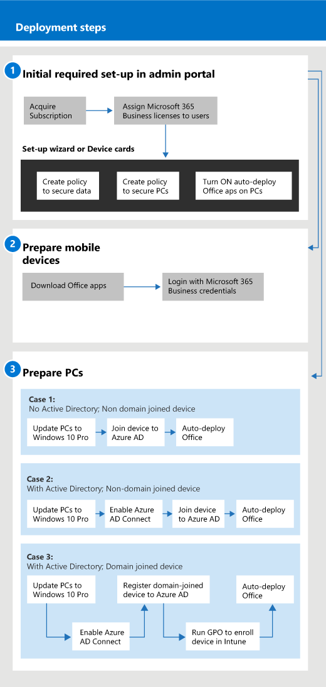

# תחילת העבודה עם Microsoft 365 Business

## מהו Microsoft 365 Business

Microsoft 365 Business הוא ערכה מקיפה של כלים לפרודוקטיביות ושיתוף פעולה עסקיים, כגון Outlook, Word, Excel ומוצרי Office אחרים, שתמיד עדכניים. אתה יכול להגן על קבצי העבודה שלך על כל iOS שלך, אנדרואיד, ו-Windows 10 התקנים עם אבטחה ברמה ארגונית כי הוא פשוט לנהל.

צפה בסרטון וידאו זה סקירה מהירה של Microsoft 365 Business.  

> [!VIDEO https://www.microsoft.com/videoplayer/embed/RE2mhaA] 
  
העסק של Microsoft 365 מיועד לרשיונות של עד 300. אם אתה זקוק לרשיונות נוספים, עיין בתיעוד [הארגוני של Microsoft 365](https://go.microsoft.com/fwlink/p/?linkid=860986) לקבלת מידע נוסף. 
  
## השג את Microsoft 365 Business

- אם יש לך שותף, הם יוכלו לקבל את Microsoft 365 Business: [קבל את microsoft 365 business ממרכז השותפים של microsoft](get-microsoft-365-business.md).
    
- אם אין לך שותף ואתה מעוניין להשיג את Microsoft 365 Business, באפשרותך [לקנות אותו כאן](https://www.microsoft.com/microsoft-365/business).
    
## התקנת Microsoft 365 Business

 **מבט כולל על חבילת העסקים של Microsoft 365 מוגדר**
  
הדיאגרמה הבאה מתארת כיצד מנהלים מגדיר עסק של Microsoft 365 Business. היא גם מתארת את השלבים להכנת מחשבי Windows עבור Microsoft 365 Business. באפשרותך גם להוסיף התקנים חדשים במרכז הניהול העסקי של Microsoft 365 עם [Windows טייס אוטומטי](add-autopilot-devices-and-profile.md). באפשרותך להשתמש בטייס אוטומטי כדי להגדיר ולהגדיר מראש התקנים חדשים, כך שהם מוכנים לשימוש פרודוקטיבי ברגע שהמשתמש שלטים עם האישורים העסקיים של Microsoft 365 שלהם.
  

צפה בסרטון וידאו זה למבט כולל על ההתקנה העסקית של Microsoft 365.  

> [!VIDEO https://www.microsoft.com/videoplayer/embed/RE1FYSM] 

אם סרטון וידאו זה היה שימושי עבורך, עיין ב[סדרת ההדרכה המלאה עבור עסקים קטנים ומשתמשים חדשים ב- Microsoft 365](https://support.office.com/article/6ab4bbcd-79cf-4000-a0bd-d42ce4d12816).

  
### 1: הגדרת מיקרוסופט 365 עסקים (מנהל)

היכנס אל [מרכז הניהול העסקי של microsoft 365](https://portal.office.com/adminportal/home) עם אישורי המנהל הגלובליים שלך והשלם את השלבים הבאים כדי להגדיר את Microsoft 365 Business. 
  
1. [דרישות מוקדמות להגנה על נתונים בהתקנים עם Microsoft 365 Business](pre-requisites-for-data-protection.md)
    
    קרא תחילה את הדרישות המוקדמות כדי לוודא שההתקנים שלך מוכנים ל-Microsoft 365 Business.
    
2. [השתמש באשף ההתקנה כדי להגדיר את Microsoft 365 Business](set-up.md)
    
    אם אתה **עובר לצמיתות מתוך Active Directory מקומי אל ענן הצמתים**, באפשרותך לעבור אל מרכז הניהול העסקי של Microsoft 365 ולהשתמש באשף ההתקנה כדי להוסיף את המשתמשים שלך באופן ידני, או לבצע סינכרון חד פעמי עם התחברות באמצעות התכלת לספירה. ניתן לעשות זאת בשתי דרכים: 
    
    - אם יש לך גם שרת Exchange 2010, Exchange 2013 או Exchange 2016, [באפשרותך להשתמש באפשרות ' היברידית מינימלית ' כדי להעביר במהירות תיבות דואר של exchange ל-Office 365](https://support.office.com/article/fdecceed-0702-4af3-85be-f2a0013937ef). השלבים ההיברידיים המינימליים כוללים סינכרון חד פעמי של משתמשים לתכלת, והעברת דואר אלקטרוני מקומית לענן. לאחר השלמת העברת הדואר האלקטרוני, סינכרון הספריות מבוטל באופן אוטומטי בעת שימוש בשיטה זו.
    
    - השתמש באשף סינכרון הספריות של Office 365 כדי לסנכרן את המשתמשים לענן הצמתים. בצע את השלבים המפורטים תחת [Set up directory synchronization for Office 365](https://support.office.com/article/1b3b5318-6977-42ed-b5c7-96fa74b08846) כדי להשלים את התהליך. לאחר סינכרון המשתמשים לענן הצמתים, יהיה עליך [לבטל סינכרון ספריות עבור Office 365](https://support.office.com/article/ee5f861e-bd48-4267-83d1-a4ead4b4a00d).
    
    תצטרך גם לתת לכל משתמש שנוסף בדרך זו רשיון ל-Microsoft 365 Business. באפשרותך לעשות זאת [באשף ההתקנה](set-up.md) או [להקצות רשיונות למשתמשים ב-Office 365 עבור עסקים](https://support.office.com/article/997596B5-4173-4627-B915-36ABAC6786DC).
    
### 2: הכנת מכשירים ניידים

בצע את השלבים [בהגדרת התקנים ניידים עבור microsoft 365 משתמשים עסקיים](set-up-mobile-devices.md) כדי להתקין יישומי Office בהתקנים ולוודא שהם מוגנים על-ידי Microsoft 365 Business. 
  
### 3: הכנת מחשבים אישיים

מנהלים יכולים לבחור הגדרות מראש עבור מחשבים חדשים של Windows 10 באמצעות [Windows טייס אוטומטי](add-autopilot-devices-and-profile.md). משתמשים יכולים להגדיר את ההתקנים הקיימים או החדשים של Windows 10 על-ידי ביצוע השלבים בנושא זה: [הגדרת מחשבי Windows עבור משתמשים עסקיים של Microsoft 365](set-up-windows-devices.md). עבור התקנים קיימים, משתמשים יכולים באופן **אופציונלי** [להעביר קבצים לכונן אחד עבור Business](move-files-to-onedrive.md). הם יכולים גם להשתמש בכלים של צד שלישי כדי להעביר קבצים המשויכים לפרופיל של Windows ל-OneDrive.
  
אם הארגון שלך משתמש ב-Windows Server Active Directory מקומי, באפשרותך להגדיר את Microsoft 365 Business כדי להגן על התקני Windows 10 שלך, תוך שמירה על גישה למשאבים מקומיים המחייבים אימות מקומי. בצע את השלבים [בהפעלת התקני Windows 10 המצורפים לתחום כדי שיוכלו להיות מנוהלים על-ידי Microsoft 365 Business](manage-windows-devices.md) כדי להגדיר זאת. שיטה זו מועדפת, והתקנים במצב זה נקראים " **היברידית תכלת" התקנים המצורפים**. 
  
אם אתה שומר על Active Directory מקומי המכיל משאבים מסוימים מקומיים (כגון שיתופי קבצים ומדפסות), באפשרותך להעניק **להתקנים המצורפים** למשאבים הללו גישה אל משאבים אלה על-ידי ביצוע השלבים כאן: [גישה למשאבים מקומיים ממכשיר תכלת המצורף ב-Microsoft 365 Business](access-resources.md).
  
  
## פנה לתמיכה

 **אם עליך ליצור קשר עם התמיכה:**
  
- פנה לשותף שלך.
    
- כמנהל עסקים של Microsoft 365, יש לך גישה לצוות התמיכה בלקוחות שלנו: ** [צור קשר עם תמיכה במוצרים עסקיים-עזרה מנהל](https://support.office.com/article/32a17ca7-6fa0-4870-8a8d-e25ba4ccfd4b)**
    
## למידע נוסף

[תיעוד ומשאבים עבור Microsoft 365 Business](https://go.microsoft.com/fwlink/p/?linkid=853701)
  
[ניהול Microsoft 365 Business](manage.md)[מעבר אל Microsoft 365 Business](migrate-to-microsoft-365-business.md)

[סרטוני הדרכה בנושא Microsoft 365 Business](https://support.office.com/article/6ab4bbcd-79cf-4000-a0bd-d42ce4d12816) 
