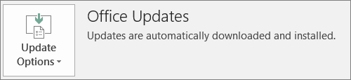

# הכנה לפריסת לקוח Office על-ידי Microsoft 365 לעסקים

## הכנה להתקנה אוטומטית של יישומי Office במחשבי לקוח

באפשרותך להשתמש ב-Microsoft 365 לעסקים כדי להתקין באופן אוטומטי 32 את יישומי Office ב-Windows 10 ולשמור אותם עדכניים באמצעות עדכונים.
  
ההתקנה האוטומטית פועלת באופן הטוב ביותר אם המחשב של משתמש הקצה הוא ב-Windows 10 Business ו:
  
- הוא אינו כולל יישומים שולחניים קיימים של Office (‏Word, ‏Excel, ‏PowerPoint, ‏Outlook, ‏OneNote, ‏Publisher, ‏Access ו- OneDrive).
    
    או
    
- מותקנת בו גירסה קיימת של Office מסוג 'לחץ והפעל'.
    
כדי לקבוע אם יש לך גירסת 'לחץ והפעל' של Office, בכל יישום של Office, עבור אל **קובץ** \> **חשבון** ( **חשבון Office** ב- Outlook). אם אתה רואה **עדכונים של Office** כפי שמוצג באיור הבא, ההתקנה נעשתה על-ידי שימוש בלחיצה-להפעלה. 
  

  
 **שנהנה מתכונה זו**
  
משתמש קצה שהמחשב שלו:
  
- **כולל** רישיון משתמש עסקי של Windows 10, 365 פעיל של Microsoft עבור רשיון עסקי, Windows 10 יוצרי עדכונים, והוא מצורף לספריית הפעילים התכולים. 
    
- אין **ברשותך** יישומי Office 64-bit (לדוגמה: Word, Excel, PowerPoint). אם 64-bit apps Office נדרשים, תכונה זו אינה מתאימה בכלל, משום שאין תמיכה בהפעלת גירסה 64-bit 2016 לחץ-להפעלה של Office מ-Microsoft 365 עבור מסוף ניהול עסקי. 
    
- **אינו כולל** יישומים עצמאיים של Windows Installer (MSI) 2016 (לדוגמה, Visio או Project). Microsoft 365 עבור שדרוגים עסקיים Office לגירסת הלחיצה-להפעלה של Office 2016 ושאינה פועלת עם יישומים עצמאיים של Office 2016 MSI. 
    
הטבלה הבאה מציגה את הפעולה שייתכן כי משתמשי הקצה/מנהלים יצטרכו לנקוט, בהתאם למצב ההתחלה שלהם, לקבל גירסה מוצלחת של 32 סיביות להפעלה של פריסת Office מ-Microsoft 365 עבור מסוף ניהול עסקי.
  
|**הפעלת מצב ההתקנה של Office**|**פעולה לביצוע לפני Microsoft 365 עבור התקנת Office עסקיים**|**מצב סיום**|
|:-----|:-----|:-----|
|לא הותקנה חבילת Office    |ללא    |Office 2016 32-bit מותקן באמצעות ' לחץ להפעלה '    |
|גירסת 'לחץ והפעל' קיימת של Office מסוג 32 סיביות (2016 או גירסה קודמת) וללא יישומים עצמאיים    |ללא    |שדרוג לגירסת 'לחץ והפעל' האחרונה של Office 2016 מסוג 32 סיביות, לפי הצורך **\***   |
|גירסת לחיצה על הפעלה מסוג 32-bit של Office ולחיצה-להפעלה קיימת, 32-bit או 64-bit של יישומי Office עצמאיים (לדוגמה, Visio, Project)    |ללא    |יישומים עצמאיים אינם מושפעים. שדרוג החבילה לגירסת 'לחץ והפעל' של Office 2016 מסוג 32 סיביות    |
|גירסת 'לחץ והפעל' קיימת של Office מסוג 32 סיביות ויישומי Office עצמאיים של MSI מסוג 32 או 64 סיביות (למעט 2016)    |ללא    |יישומים עצמאיים אינם מושפעים. שדרוג החבילה לגירסת 'לחץ והפעל' של Office 2016 מסוג 32 סיביות    ||||
|גירסת 'לחץ והפעל' קיימת של Office מסוג 64 סיביות    |הסר את ההתקנה של יישומי Office 64-bit, אם זה בסדר להחליף אותם ביישומי Office בעלי 32 סיביות    |אם אתה מסיר את יישומי Office מסוג 64 סיביות, גירסת 'לחץ והפעל' של Office 2016 מסוג 32 סיביות מותקנת    |
|התקנת MSI קיימת של Office 2016 עם או בלי יישומים עצמאיים    |הסרת התקנה של MSI Office 2016.    |מותקנת גירסת 'לחץ והפעל' של Office 2016 מסוג 32 סיביות. ללא שינוי ביישומים עצמאיים    |
|התקנת MSI קיימת של Office 2013 (או גירסה קודמת) ו/או יישומי Office עצמאיים    |ללא    |גירסת 'לחץ והפעל' של Office 2016 מסוג 32 סיביות עם התקנת MSI Office קיימת מראש (ויישומים עצמאיים) מתקיימות זו לצד זו    |
||||
   
 **(\*) הערה:** לא מתקיים שדרוג לגירסת 'לחץ והפעל' של Office 2016 מסוג 32 סיביות עקב באג ידוע. . התיקון מתבצע 
  
