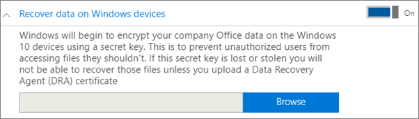
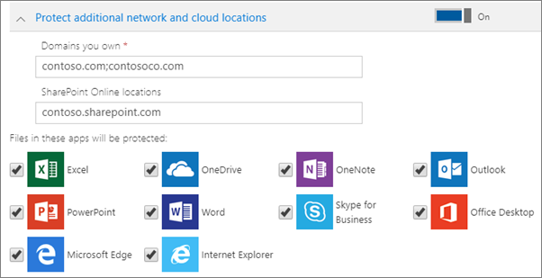

# הגדרה או עריכה של הגדרות הגנה של יישומים עבור מכשירי Windows 10

מאמר זה חל על Microsoft 365 Business Premium.

## עריכת מדיניות ניהול יישומים עבור Windows 10

1. עבור אל מרכז הניהול ב <a href="https://go.microsoft.com/fwlink/p/?linkid=837890" target="_blank">https://admin.microsoft.com</a> -.     
2. בסרגל הניווט הימני **Devices** , בחר \> **מדיניות** מכשירים.
1. בחר מדיניות קיימת של Windows app ולאחר מכן **ערוך**.
1. בחר **ערוך** לצד הגדרה שברצונך לשנות ולאחר מכן **שמור**.

## יצירת מדיניות לניהול יישומים עבור Windows 10

אם למשתמשים שלך יש מכשירים אישיים של Windows 10 שהם מבצעים דרכם משימות עבודה, באפשרותך להגן על הנתונים שלך גם במכשירים אלה.
  
1. עבור אל מרכז הניהול ב <a href="https://go.microsoft.com/fwlink/p/?linkid=837890" target="_blank">https://admin.microsoft.com</a> -. 
2. בסרגל הניווט הימני **Devices** , בחר באפשרות \> הוסף **מדיניות** מכשירים \> **Add**.
3. בחלונית **הוסף מדיניות**, הזן שם ייחודי עבור מדיניות זו. 
4. תחת **סוג מדיניות**, בחר **ניהול יישומים עבור Windows 10**.
5. תחת **סוג מכשיר**, בחר **אישית** או **חברה בבעלות**.
6. האפשרות **הצפן קבצי עבודה** מופעלת באופן אוטומטי. 
7. קבע את ההגדרה **מנע ממשתמשים להעתיק נתוני חברה לקבצים אישיים וכפה עליהם לשמור קבצי עבודה ב- OneDrive for Business** למצב **מופעל** אם אינך מעוניין שהמשתמשים ישמרו קבצי עבודה במחשב שלהם. 
9. הרחב את **שחזור הנתונים במכשירי Windows**. **מומלץ להפעיל**אותה.
    לפני שתוכל לנווט אל מיקום האישור של סוכן שחזור הנתונים, עליך תחילה ליצור את האישור. לקבלת הוראות, ראה [יצירה ואימות של אישור סוכן שחזור נתונים (EFS) של מערכת קבצים מצפינה (EFS](https://go.microsoft.com/fwlink/p/?linkid=853700)).
    
    כברירת מחדל, קבצי עבודה מוצפנים באמצעות מפתח סודי שמאוחסן במכשיר ומשויך לפרופיל של המשתמש. רק המשתמש יכול לפתוח ולפענח את הקובץ. עם זאת, במקרה של אובדן המכשיר או הסרת משתמש, הקובץ יכול להיתקע במצב מוצפן. מנהל מערכת יכול להשתמש באישור סוכן שחזור נתונים (DRA) כדי לפענח את הקובץ.
    
    
  
10. הרחב את **ההגנה על מיקומים נוספים ברשת ובענן** אם ברצונך להוסיף תחומים נוספים או מיקומים של SharePoint Online כדי לוודא שהקבצים בכל היישומים הרשומים מוגנים. אם עליך להזין יותר מפריט אחד עבור שדה כלשהו, השתמש בנקודה-פסיק (;) בין הפריטים.
    
    
  
11. לאחר מכן החלט **מי יקבל הגדרות אלה?** אם אינך מעוניין להשתמש בקבוצת האבטחה המוגדרת כברירת מחדל **כל המשתמשים**, בחר **שינוי**, בחר את קבוצות האבטחה שיקבלו הגדרות אלה \> **בחר**.
12. לבסוף, בחר **הוסף** כדי לשמור את המדיניות והקצה אותה למכשירים. 
