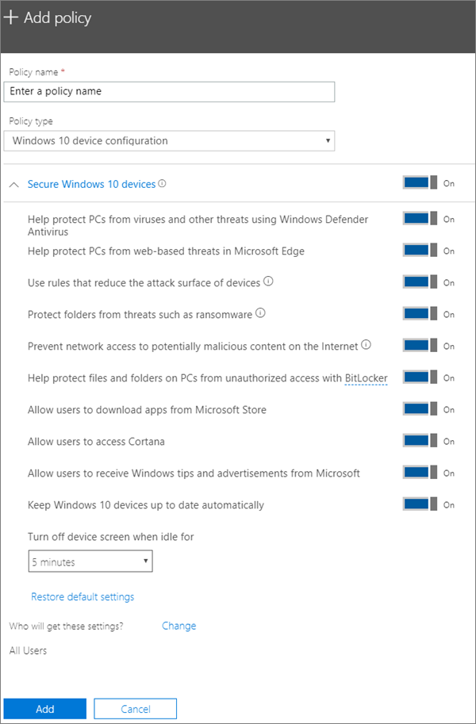

# עריכה או יצירה של הגדרות הגנה על מכשיר עבור מחשבי Windows 10Edit or create device protection settings for Windows 10 PCs

מאמר זה חל על Microsoft 365 Business Premium.This article applies to Microsoft 365 Business Premium.

לאחר הגדרת הגדרות ברירת המחדל להגנה על Windows בדף ההגדרה, באפשרותך להוסיף הגדרות חדשות החלות על כל המשתמשים או על קבוצת משתמשים.After you have set set up default Windows protection settings on the Setup page, you can add new ones that apply to either all users, or a set of users. באפשרותך גם לערוך כל אחד מהעורכים שיצרת.You can also edit any of the ones you have created.

## יצירת הגדרות הגנה עבור מכשירי Windows 10Create protection settings for Windows 10 devices

הצג סרטון וידאו על אבטחת מכשירי Windows 10 באמצעות Microsoft 365 Business Premium:View a video on how to secure Windows 10 devices with Microsoft 365 Business Premium:
  
> [!VIDEO https://www.microsoft.com/videoplayer/embed/a5734146-620a-4cec-8618-536b3ca37972?autoplay=false]
  
1. עבור אל מרכז הניהול <a href="https://go.microsoft.com/fwlink/p/?linkid=837890" target="_blank">https://admin.microsoft.com</a> ב- .Go to the admin center at <a href="https://go.microsoft.com/fwlink/p/?linkid=837890" target="_blank">https://admin.microsoft.com</a>. 
2. בסרגל הניווט הימני, בחר **מדיניות** \> **מכשירים** \> **הוסף**.On the left nav, choose **Devices** \> **Policies** \> **Add**.
3. בחלונית **הוסף מדיניות**, הזן שם ייחודי עבור מדיניות זו.On the **Add policy** pane, enter a unique name for this policy. 
4. תחת **סוג מדיניות**, בחר **תצורת מכשיר Windows 10**.Under **Policy type**, choose **Windows 10 Device Configuration**.
5. הרחב את **אבטחת מכשירי 10 Windows** \> קבע את תצורת ההגדרות כפי שאתה רוצה.Expand **Secure Windows 10 Devices** \> configure the settings how you would like. לקבלת מידע נוסף, ראה [הגדרות זמינות](#available-settings).For more information, see [Available settings](#available-settings). 
    
    ניתן להשתמש תמיד בקישור **איפוס הגדרות ברירת מחדל** כדי לחזור להגדרת ברירת המחדל.You can always use the **Reset default settings** link to return to the default setting. 
    
    
  
6. לאחר מכן החלט **מי יקבל הגדרות אלה?** אם אינך מעוניין להשתמש בקבוצת האבטחה המוגדרת כברירת מחדל **כל המשתמשים**, בחר **שינוי**, חפש את קבוצת האבטחה שתקבל הגדרות אלה \> **בחר**.Next decide **Who will get these settings?** If you don't want to use the default **All users** security group, Choose **Change**, search for the security group who will get these settings \> **Select**.
7. לבסוף, בחר **סיום** כדי לשמור את המדיניות והקצה אותה למכשירים.Finally, choose **Done** to save the policy, and assign it to devices. 

## עריכת הגדרות הגנה של Windows 10Edit Windows 10 protection settings
 
1. עבור אל מרכז הניהול <a href="https://go.microsoft.com/fwlink/p/?linkid=837890" target="_blank">https://admin.microsoft.com</a> ב- .Go to the admin center at <a href="https://go.microsoft.com/fwlink/p/?linkid=837890" target="_blank">https://admin.microsoft.com</a>.     
2. בסרגל הניווט הימני, בחר **מדיניות** \> **מכשירים** .On the left nav, choose **Devices** \> **Policies** .
1. בחר מדיניות קיימת של מכשיר Windows ולאחר מכן **ערוך**.Choose an existing Windows device policy and then **Edit**.
1. בחר **ערוך** לצד הגדרה שברצונך לשנות ולאחר מכן **שמור**.Choose **Edit** next to a setting you want to change and then **Save**.

## הגדרות זמינותAvailable settings

כברירת מחדל כל ההגדרות מוגדרות ל **פעיל**.By default all settings are **On**. ההגדרות הבאות זמינות.The following settings are available.
  
לקבלת מידע נוסף, ראה [כיצד ניתן להגן על תכונות במפה של Microsoft 365 Premium להגדרות Intune](map-protection-features-to-intune-settings.md).For more information, see [How do protection features in Microsoft 365 Premium map to Intune settings](map-protection-features-to-intune-settings.md). 
  
|||
|:-----|:-----|
|הגדרהSetting    |תיאורDescription    |
|עזור בהגנה על מחשבים מפני וירוסים ואיומים אחרים באמצעות האנטי-וירוס של Windows DefenderHelp protect PCs from viruses and other threats using Windows Defender Antivirus    |דרושה הפעלה של האנטי-וירוס של Windows Defender כדי להגן על מחשבים מהסכנות הכרוכות בחיבור לאינטרנט.Requires that Windows Defender Antivirus is turned on to protect PCs from the dangers of being connected to the internet.    |
|עזור בהגנה על מחשבים מפני איומים מבוססי-אינטרנט ב- Microsoft EdgeHelp protect PCs from web-based threats in Microsoft Edge    |הפעלת הגדרות ב- Microsoft Edge שעוזרות בהגנה על המשתמשים מפני אתרים זדוניים והורדות.Turns on settings in Edge that help protect users from malicious sites and downloads.    |
|שימוש בכללים המקטינים את שטח התקיפה של מכשיריםUse rules that reduce the attack surface of devices    |כאשר צמצום שטח התקיפה מופעל, הוא עוזר בחסימת פעולות ויישומים המשמשים בדרך כלל תוכניות זדוניות כדי לזהם מכשירים. הגדרה זו זמינה רק אם אנטי-וירוס של Windows Defender מופעל. ראה [צמצום שטחי תקיפה](/windows/security/threat-protection/microsoft-defender-atp/exploit-protection) כדי לקבל מידע נוסף.  When turned On, attack surface reduction helps block actions and apps typically used by malware to infect devices. This setting is only available if Windows Defender Antivirus is set to On. See [Reduce attack surfaces](/windows/security/threat-protection/microsoft-defender-atp/exploit-protection) to learn more.    |
|הגנה על תיקיות מפני איומים כגון תוכנת כופרProtect folders from threats such as ransomware    |הגדרה זו משתמשת בגישה מבוקרת לתיקיות כדי להגן על נתוני החברה מפני שינויים על-ידי יישומים חשודים או זדוניים, כגון תוכנות כופר.This setting uses controlled folder access to protect company data from modification by suspicious or malicious apps, such as ransomware. סוגי יישומים אלה אינם יכולים לבצע שינויים בתיקיות מוגנות.These types of apps are blocked from making changes in protected folders. הגדרה זו זמינה רק אם אנטי-וירוס של Windows Defender מופעל.This setting is only available if Windows Defender Antivirus is set to On. ראה [הגנה על תיקיות עם גישה מבוקרת לתיקיות](/mem/configmgr/protect/deploy-use/create-deploy-exploit-guard-policy#bkmk_CFA) כדי לקבל מידע נוסף.See [Protect folders with Controlled folder access](/mem/configmgr/protect/deploy-use/create-deploy-exploit-guard-policy#bkmk_CFA) to learn more.    |
|מניעת גישה לרשת של תוכן באינטרנט שעשוי להיות זדוניPrevent network access to potentially malicious content on the Internet    |השתמש בהגדרה זו כדי לחסום חיבורי משתמשים יוצאים למיקום אינטרנט בעל מוניטין נמוך, העשויים לארח הונאות דיוג, ניצול לרעה או תוכן זדוני אחר.Use this setting to block outbound user connections to low-reputation Internet locations that may host phishing scams, exploits, or other malicious content. הגדרה זו זמינה רק אם האנטי-וירוס של Windows Defender מוגדר **ל' פועל.**This setting is only available if Windows Defender Antivirus is set to **On**. לקבלת מידע נוסף, ראה [הגנה על הרשת שלך.](/windows/security/threat-protection/windows-defender-antivirus/configure-real-time-protection-windows-defender-antivirus)For more information, see [Protect your network](/windows/security/threat-protection/windows-defender-antivirus/configure-real-time-protection-windows-defender-antivirus).    |
|עזור להגן על קבצים ותיקיות במחשבים מפני גישה לא מורשית באמצעות BitLockerHelp protect files and folders on PCs from unauthorized access with BitLocker    |Bitlocker מגן על נתונים על-ידי הצפנת הכוננים הקשיחים של המחשב ומגן מפני חשיפת נתונים אם מחבר אבד או נגנב.Bitlocker protects data by encrypting the computer hard drives and protect against data exposure if a computer is lost or stolen. לקבלת מידע נוסף, ראה [שאלות נפוצות אודות Bitlocker](/windows/security/information-protection/bitlocker/bitlocker-frequently-asked-questions).For more information, see [Bitlocker FAQ](/windows/security/information-protection/bitlocker/bitlocker-frequently-asked-questions).    |
|אפשר למשתמשים להוריד אפליקציות מ- Microsoft StoreAllow users to download apps from Microsoft Store    |הגדרה זו מאפשרת למשתמשים להוריד ולהתקין אפליקציות מ- Microsoft Store. אפליקציות כוללות את כל סוגי התוכן, החל ממשחקים וכלה בכלי פרודוקטיביות, לכן אנו משאירים הגדרה זו במצב **מופעל**, אך ניתן לבטל אותה להשגת אבטחה נוספת.  Lets users download and install apps from the Microsoft Store. Apps include everything from games to productivity tools, so we leave this setting **On**, but you can turn it off for extra security.    |
|אפשר למשתמשים לגשת ל- CortanaAllow users to access Cortana    |Cortana יכולה להיות שימושית מאוד!Cortana can be very helpful! Cortana יכולה להפעיל או לבטל הגדרות בשבילך, לתת הוראות הגעה, לוודא שאתה נמצא בזמן לפעילויות, ולכן אנו שומרים על הגדרה זו **כברירת** מחדל.Cortana can turn settings on or off for you, give directions, and make sure you're on time for appointments, so we keep this setting **On** by default.    |
|אפשר למשתמשים לקבל עצות ופרסומות בנושא Windows מ- MicrosoftAllow users to receive Windows tips and advertisements from Microsoft    |העצות של Windows יכולות להיות שימושיות ולעזור למשתמשים להתמצא בעת הפצת התכונות החדשות.Windows tips can be handy and help orient users when new features are released.    |
|עדכן מכשירים של Windows 10 באופן אוטומטיKeep Windows 10 devices up to date automatically    |הגדרה זו מוודאת שמכשירי Windows 10 מקבלים באופן אוטומטי את העדכונים האחרונים.Makes sure that Windows 10 devices automatically receive the latest updates.    |
|כבה את מסך המכשיר כשהוא לא פעיל במשךTurn off device screen when idle for this amount of time    |הגדרה זו מוודאת שנתוני החברה מוגנים אם המשתמש אינו פעיל. ייתכן מצב שבו משתמש מסוים עובד במקום ציבורי, למשל בית קפה, שבו הוא מתרחק או שדעתו מוסחת לרגע קט ומשאיר את המכשיר שלו חשוף להצצות אקראיות. הגדרה זו מאפשרת לך לקבוע כמה זמן המשתמש יכול להיות לא פעיל לפני כיבוי המסך.Makes sure that company data is protected if a user is idle. A user may be working in a public location, like a coffee shop, and step away or be distracted for just a moment, leaving their device vulnerable to random glances. This setting lets you control how long the user can be idle before the screen shuts off.    |