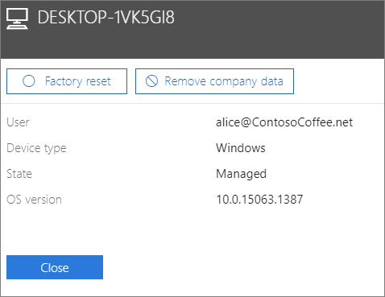

# הסרת נתוני חברה ממכשיריםRemove company data from devices

מאמר זה חל על Microsoft 365 Business Premium.This article applies to Microsoft 365 Business Premium.

## הסרת נתוני חברהRemove company data

באפשרותך להשתמש ב- Microsoft 365 לעסקים כדי להסיר  נתוני חברה שלמשתמשים שלך במכשירים או [במחשבי Windows](protection-settings-for-windows-10-devices.md) שלהם המוגנים על-ידי Microsoft 365.You can use Microsoft 365 for business to remove company data that your users have on their [devices](app-protection-settings-for-android-and-ios.md) or [Windows PCs](protection-settings-for-windows-10-devices.md) that are protected by Microsoft 365. **אם תסיר נתוני חברה ממכשיר, לא תוכל לשחזר אותם לאחר מכן**.**If you remove company data from a device, you cannot restore it later**. 
  
1. עבור אל מרכז הניהול <a href="https://go.microsoft.com/fwlink/p/?linkid=837890" target="_blank">https://admin.microsoft.com</a> ב- .Go to the admin center at <a href="https://go.microsoft.com/fwlink/p/?linkid=837890" target="_blank">https://admin.microsoft.com</a>.
    
2. בסרגל הניווט הימני, בחר **מכשירים** \> **ניהול**.  On the left nav, choose **Devices**  \> **Manage**.
  
3. בדף **ניהול,** בחר או חפש משתמש שברצונך להסיר את הנתונים שלו ובחר את השם.On the **Manage** page, choose or search for a user who's data you want to remove, and choose the name. 
    
4. בחלונית הבאה, בחר את המכשיר או המכשירים מהרשימה **מכשירים.**On the next pane, select the device or devices from the **Devices** list. בחלונית המכשיר שנפתחת, באפשרותך לבחור לאפס את המכשיר להגדרות היצרן או להסיר נתוני חברה, בהתאם לסוג המכשיר.On the device pane that opens, you can choose to reset the device to factory settings or remove company data, depending on the device type. 
    
    
  
5. בחלונית האישור, בחר **אישור** \> **סגירה**.On the confirmation pane, choose **Confirm** \> **Close**.
    

