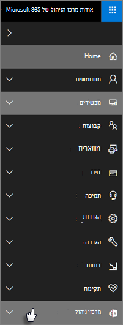

# מיקרוסופט 365 תכונות אבטחה ותאימות של העסקMicrosoft 365 Business security and compliance features

Microsoft 365 Business מציע תכונות אבטחה פשוטות יותר כדי לסייע בהגנה על הנתונים שלך במחשבים, בטלפונים ובטבליות.Microsoft 365 Business offers simplified security features to help safeguard your data on PCs, phones, and tablets.
    
## מיקרוסופט 365 מרכז עסקים ניהול תכונות אבטחהMicrosoft 365 Business admin center security features

באפשרותך לנהל רבות מתכונות האבטחה העסקיות של Microsoft 365 במרכז הניהול, המעניקה לך דרך פשוטה להפעיל או לבטל תכונות אלה.You can manage many of the Microsoft 365 Business security features in the admin center, which gives you a simplified way to turn these features on or off. במרכז הניהול, באפשרותך לבצע את הפעולות הבאות:In the admin center, you can do the following:
  
- [קביעת הגדרות ניהול יישומים עבור מכשירי Android או iOS](app-protection-settings-for-android-and-ios.md) .[Set application management settings for Android or iOS devices](app-protection-settings-for-android-and-ios.md) . 
    
    הגדרות אלה כוללות מחיקת קבצים מהתקן לא פעיל לאחר תקופת ערכה, הצפנת קבצי עבודה, המחייב הגדרת משתמשים להגדיר PIN וכן הלאה.These settings include deleting files from an inactive device after a set period, encrypting work files, requiring that users set a PIN, and so on.
    
- [קביעת הגדרות הגנת יישומים עבור התקני Windows 10](protection-settings-for-windows-10-devices.md) .[Set application protection settings for Windows 10 devices](protection-settings-for-windows-10-devices.md) . 
    
    ניתן להחיל הגדרות אלה על נתוני חברה הן בבעלות החברה והן בהתקנים הנמצאים בבעלות אישית.These settings can be applied to company data on both company-owned, or personally owned devices.
    
- [קביעת הגדרות הגנת התקן עבור התקני Windows 10](protection-settings-for-windows-10-pcs.md) .[Set device protection settings for Windows 10 devices](protection-settings-for-windows-10-pcs.md) . 
    
    באפשרותך להפוך את הצפנת [BitLocker](https://go.microsoft.com/fwlink/p/?linkid=871405) לזמינה כדי לסייע בהגנה על נתונים במקרה של אובדן או גניבה של התקן, ולאפשר [למשמר הניצול של Windows](https://docs.microsoft.com/windows/security/threat-protection/microsoft-defender-atp/enable-exploit-protection) לספק הגנה מתקדמת מפני ransomware.You can enable [BitLocker](https://go.microsoft.com/fwlink/p/?linkid=871405) encryption to help protect data in case a device is lost or stolen, and enable [Windows Exploit Guard](https://docs.microsoft.com/windows/security/threat-protection/microsoft-defender-atp/enable-exploit-protection) to provide advanced protection against ransomware. 
    
- [הסרת נתוני חברה ממכשיריםRemove company data from devices](remove-company-data.md)
    
    באפשרותך למחוק מרחוק נתוני חברה אם התקן אובד, נגנב או עובד עוזב את החברה שלך.You can remotely wipe company data if a device is lost, stolen, or an employee leaves your company.
    
- [אפס את התקני Windows 10 להגדרות המפעל שלהם](reset-devices-to-factory-settings.md) .[Reset Windows 10 devices to their factory settings](reset-devices-to-factory-settings.md) . 
    
    באפשרותך לאפס התקני Windows 10 שהוחלו עליהם הגדרות הגנת התקן.You can reset any Windows 10 devices that have device protection settings applied to them.
    
## תכונות אבטחה נוספתAdditional security features 

תכונות מתקדמות ב-Microsoft 365 Business זמינות כדי לסייע לך להגן על העסק שלך מפני איומי סייבר ולהגן על מידע רגיש.Advanced features in Microsoft 365 Business are available to help you protect your business against cyber-threats and safeguard sensitive information.
  
- **[הגנת האיום המתקדם של Office 365](https://support.office.com/article/e100fe7c-f2a1-4b7d-9e08-622330b83653)****[Office 365 Advanced Threat Protection](https://support.office.com/article/e100fe7c-f2a1-4b7d-9e08-622330b83653)**
    
    הגנת האיומים המתקדמת (ATP) מסייעת לשמור על העסק שלך מפני התקפות דיוג וransomware מתוחכמות המיועדות לפגוע בפרטי העובד או הלקוח.Advanced Threat Protection (ATP) helps guard your business against sophisticated phishing and ransomware attacks designed to compromise employee or customer information. התכונות כוללות:Features include:
    
  - סריקת מצורף מתוחכם וניתוח AI מופעל כדי לזהות ולמחוק הודעות מסוכנות.Sophisticated attachment scanning and AI-powered analysis to detect and discard dangerous messages.
    
  - בדיקות אוטומטיות של קישורים בדואר אלקטרוני כדי להעריך אם הם מהווים חלק ממזימת דיוג.Automatic checks of links in email to assess if they're part of a phishing scheme. פעולה זו שומרת עליך מפני גישה לאתרים לא בטוחים.This keeps you safe from accessing unsafe websites.

- **[היכולות המלאות של Intune בפורטל התכלת](https://go.microsoft.com/fwlink/p/?linkid=871403)****[The full capabilities of Intune in the Azure portal](https://go.microsoft.com/fwlink/p/?linkid=871403)**
    
    גישה למרכז admin Intune בפורטל תכלת מאפשר לך להגדיר תכונות אבטחה נוספות, כגון ניהול של התקני MacOS, iPhone, והתקנים אנדרואיד, יחד עם ניהול התקנים מתקדמים עבור Windows, כי אינם זמינים באמצעות Microsoft 365 מרכז עסקים.Accessing the Intune admin center in the Azure portal allows you to set up additional security features, such as management of MacOS devices, iPhone, and Android devices, along with advanced device management for Windows, that aren't available through Microsoft 365 Business admin center.
- **[גישה מותנית](https://docs.microsoft.com/azure/active-directory/conditional-access/overview) זהה לתוכנית התכלת של AD P1****Same [Conditional Access](https://docs.microsoft.com/azure/active-directory/conditional-access/overview) as Azure AD P1 plan**

    ' גישה מותנית ' יכולה לסייע בהגנה על הארגון שלך מפני סיכוני כניסה, גישה לנסיונות מרשת או אזור לא צפויים, access מנסה לקבל מסוגי התקנים מסוכנים וכן הלאה.Conditional Access can help protect your organization from sign-in risk, access attempts from an unexpected network or locale, access attempts from risky device types, and so on. מדיניות גישה מותנית נאכפת לאחר השלמת האימות הראשון, והיא משתמשת באותות מאירוע האימות הראשון כדי לקבוע אם יש לקבל את הגישה הרצויה, נדחתה או אם הוכחה נוספת (כגון סוג הזיהוי השני) נדרש.Conditional Access policies are enforced after the first authentication is completed, and it uses signals from the first authentication event to determine if the attempted access should be approved, denied, or if more proof (such as a second form of identification) is required.

    תכונות הגישה המותנה הכלולות הן:The conditional access features included are:

    - גישה בהתבסס על שם משתמש, קבוצה ותפקידAccess based on username, group, and role
    - גישה [בהתבסס על אפליקציה](https://docs.microsoft.com/azure/active-directory/conditional-access/app-based-conditional-access)Access [based on an app](https://docs.microsoft.com/azure/active-directory/conditional-access/app-based-conditional-access) 
    - [Access מבוסס על מיקום](https://docs.microsoft.com/azure/active-directory/authentication/howto-registration-mfa-sspr-combined#conditional-access-policies-for-combined-registration);  אפשר גישה מטווחי IP מהימנים או ממדינות ספציפיות בלבד[Access based on location](https://docs.microsoft.com/azure/active-directory/authentication/howto-registration-mfa-sspr-combined#conditional-access-policies-for-combined-registration);  only allow access from trusted IP ranges or specific countries 
    - דרוש גישה לתואר שלנוRequire MFA for access
    - חסימת גישה ליישומים המשתמשים [באימות מדור קודם](https://docs.microsoft.com/azure/active-directory/conditional-access/block-legacy-authentication)Block access to apps that use [legacy authentication](https://docs.microsoft.com/azure/active-directory/conditional-access/block-legacy-authentication)
    - דרוש יישומים tp להשתמש [Intune app הגנה](https://docs.microsoft.com/azure/active-directory/conditional-access/app-protection-based-conditional-access)Require apps tp use [Intune app protection](https://docs.microsoft.com/azure/active-directory/conditional-access/app-protection-based-conditional-access)
    - אימות מותאם אישית כגון משרד התואר השלישי עם ספקי צד שלישי, לדוגמה DUO.Custom authentication such as MFA with third-party providers, for example DUO.
   
    תכונות אחרות:Other features:
    - [איפוס סיסמה בשירות עצמי](https://docs.microsoft.com/azure/active-directory/authentication/concept-sspr-customization) עבור תכלת היברידית[Self-service password reset](https://docs.microsoft.com/azure/active-directory/authentication/concept-sspr-customization) for hybrid Azure AD
    
## מאפייני תאימותCompliance features

המנוי העסקי שלך ב-Microsoft 365 כולל תכונות המסייעות לך לשמור על תאימות ותקני רגולציה.Your Microsoft 365 Business subscription includes features that help you maintain compliance and regulatory standards.

- **[סקירה של מדיניות מניעת אובדן נתונים](https://support.office.com/article/1966b2a7-d1e2-4d92-ab61-42efbb137f5e)** (DLP).**[Overview of data loss prevention policies](https://support.office.com/article/1966b2a7-d1e2-4d92-ab61-42efbb137f5e)** (DLP). 
    
    באפשרותך להגדיר את טכנולוגיית DLP כך שתאתר באופן אוטומטי מידע רגיש, כגון מספרי כרטיסי אשראי, מספרי ביטוח לאומי וכן הלאה, כדי למנוע את השיתוף היוצא מגדר שלהם מחוץ לחברה שלך.You can set up DLP to automatically detect sensitive information, like credit card numbers, social security numbers, and so on, to prevent their inadvertent sharing outside your company.
    
- **[אחסון בארכיון של Exchange Online](https://products.office.com/exchange/microsoft-exchange-online-archiving-email)****[Exchange Online Archiving](https://products.office.com/exchange/microsoft-exchange-online-archiving-email)**
    
    הרישיון Exchange Online ארכיון מאפשר להודעות להיות בארכיון בקלות עם גיבוי נתונים רציף.Exchange Online Archiving license enables messages to be easily archived with continuous data backup. הוא מאחסן את כל המיילים של המשתמש, כולל פריטים שנמחקו, למקרה שהם נחוצים מאוחר יותר עבור גילוי או שחזור.It stores all of a user's emails, including deleted items, in case they're needed later for discovery or restoration. בנוסף, באפשרותך להשתמש בפריטי מדיניות שמירה שונים כדי לשמר נתוני דואר אלקטרוני לצורך התדיינות משפטית, גילוי eDiscovery או כדי לעמוד בדרישות התאימות.Additionally, you can use different retention policies to preserve email data for litigation holds, eDiscovery, or to meet compliance requirements.
    
- **[תוויות רגישות](https://docs.microsoft.com/microsoft-365/compliance/sensitivity-labels)****[Sensitivity labels](https://docs.microsoft.com/microsoft-365/compliance/sensitivity-labels)**

   העסק של Microsoft 365 כולל את כל התכונות של [תוכנית הגנת מידע תכלת 1](https://go.microsoft.com/fwlink/p/?linkid=871407).Microsoft 365 Business includes all the features of [Azure Information Protection Plan 1](https://go.microsoft.com/fwlink/p/?linkid=871407). באמצעות תוכנית זו, באפשרותך ליצור **תוויות רגישות** המאפשרות לך לשלוט בגישה למידע רגיש בדואר אלקטרוני ובמסמכים, עם פקדים כגון "אל תעביר" ו-"אל תעתיק".With this plan, you can create **Sensitivity labels** that allow you to control access to sensitive information in email and documents, with controls like "Do not forward" and "Do not copy." באפשרותך גם לסווג מידע רגיש כ-"סודי" ולציין כיצד ניתן לשתף מידע מסווג בחוץ ובתוך העסק.You can also classify sensitive information as "Confidential" and specify how classified information can be shared outside and inside the business. הצפנה ברמה ארגונית קלה להחלה על דואר אלקטרוני ומסמכים כדי לשמור על פרטי המידע שלך.Enterprise-grade encryption is easy to apply to email and documents to keep your information private. באפשרותך גם להתקין את התוספת של לקוח הגנת מידע תכלת עבור יישומי Office.You can also install the Azure Information Protection client add-in for Office apps. לקבלת מידע נוסף, ראה [לקוח מאוחד לתיוג מידע בתכלת](https://docs.microsoft.com/azure/information-protection/rms-client/unifiedlabelingclient-version-release-history).For more information, see [Azure Information Protection unified labeling client](https://docs.microsoft.com/azure/information-protection/rms-client/unifiedlabelingclient-version-release-history). בתוויות רגישות, התקן את ה- **AzInfoProtection_UL. exe**.For Sensitivity labels, install the **AzInfoProtection_UL.exe**.

באפשרותך לנהל תכונות אלה במרכז &amp; תאימות האבטחה ובמרכז הניהול של Intune.You can manage these features in the Security &amp; Compliance center and the Intune admin center. עם הזמן, הפקדים הפשוטים יתווספו למרכז הניהול העסקי של Microsoft 365.Over time the simplified controls will be added to the Microsoft 365 Business admin center.
  
    
## שאלות נפוצותFAQ

 ### האם תכונות אבטחה אלה זמינות בכל השווקים?Are these security features available in all markets?
  
כן, תכונות אלה זמינות בכל השווקים שבו Microsoft 365 עסקים נמכרים.Yes, these features are available in all markets where Microsoft 365 Business is sold.
  
### כיצד ניתן לאתר את &amp; מרכז תאימות האבטחה?How do I find the Security &amp; Compliance center?
  
1. [היכנס ל-Microsoft 365 Business](https://portal.microsoft.com/) באמצעות אישורי המנהל שלך.[Sign in to Microsoft 365 Business](https://portal.microsoft.com/) by using your admin credentials. 
    
2. בניווט השמאלי, אתר **מרכזי ניהול** והרחב אותו.In the left nav, locate **Admin centers** and expand it. 
    
    
  
3. בחר \*\*בתאימות אבטחה &amp; \*\* כדי לעבור &amp; אל מרכז תאימות אבטחה.Choose **Security &amp; Compliance** to go to Security &amp; compliance center.
