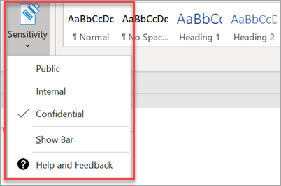

# כוונן תכונות תאימותSet up compliance features

העסק שלך ב-Microsoft 365 מגיע עם תכונות כדי להגן על הנתונים והמכשירים שלך ולסייע לך לאבטח את המידע הרגיש שלך ושל הלקוחות שלך.Your Microsoft 365 Business comes with features to protect your data and devices, and help you keep your and your customers' sensitive information secure.

## כוונן תכונות של DLPSet up DLP features

ראה [יצירת מדיניות DLP של מתבנית](https://support.office.com/article/59414438-99f5-488b-975c-5023f2254369) לדוגמה, כיצד להגדיר מדיניות להגנה מפני מידע המאפשר זיהוי אישי (PII).See [Create a DLP policy from a template](https://support.office.com/article/59414438-99f5-488b-975c-5023f2254369) for an example on how to set up a policy to protect against personally identifiable information (PII). 
  
טכנולוגיית DLP מגיעה עם תבניות מדיניות רבות ומוכנות לשימוש עבור אזורים רבים ושונים.DLP comes with many ready-to-use policy templates for many different locales. לדוגמה, הנתונים הפיננסיים של אוסטרליה, חוק המידע האישי של קנדה, הנתונים הפיננסיים של ארה ב, וכן הלאה.For example, Australia Financial Data, Canada Personal Information Act, U.S. Financial Data, and so on. ראה [מה תבניות מדיניות ה-DLP כוללות](https://support.office.com/article/c2e588d3-8f4f-4937-a286-8c399f28953a) עבור רשימה מלאה.See [What the DLP policy templates include](https://support.office.com/article/c2e588d3-8f4f-4937-a286-8c399f28953a) for a full list. ניתן להפעיל את כל התבניות הללו בדומה לדוגמת התבנית PII.All of these templates can be enabled similar to the PII template example. 
  
## הגדרת שמירת דואר אלקטרוני באמצעות ' ארכיון מקוון של Exchange 'Set up email retention with Exchange Online Archiving

 **Exchange מקוון** תכונות רישיון לעזור לשמור על תאימות וסטנדרטים רגולציה על ידי שמירה על תוכן דואר אלקטרוני עבור ediscovery.**Exchange Online Archiving** license features help maintain compliance and regulatory standards by preserving email content for eDiscovery. זה גם עוזר להפחית את הסיכון אם יש תביעה, ומספק דרך לשחזר נתונים לאחר הפרת אבטחה או כאשר אתה צריך לשחזר פריטים שנמחקו.It also helps reduce your risk if there is a lawsuit, and provides a way to recover data after a security breach or when you need to recover deleted items. באפשרותך להשתמש בחסימה לצורך תביעה משפטית כדי לשמר את כל התוכן של משתמש, או להשתמש במדיניות שמירה כדי להתאים אישית את מה שברצונך לשמר.You can use litigation hold to preserve all of a user's content, or use retention policies to customize what you want to preserve.
  
**החזקת ליטיגציה:** באפשרותך לשמור את כל תוכן תיבת הדואר כולל פריטים שנמחקו על-ידי הצבת תיבת הדואר המלאה של משתמש בחסימה לתביעה משפטית.**Litigation hold:** You can preserve all mailbox content including deleted items by putting a user's entire mailbox on litigation hold. 
    
כדי למקם תיבת דואר בחסימה ליטיגציה, במרכז הניהול:To place a mailbox on litigation hold, in the Admin center:
    
1. בניווט השמאלי, עבור אל **המשתמשים** \> **הפעילים**של המשתמשים.In the left nav, go to **Users** \> **Active users**.
    
2. בחר משתמש שאת תיבת הדואר שלו ברצונך למקם בחסימה לתביעה משפטית.Select a user whose mailbox you want to place on litigation hold. בחלונית המשתמש, הרחב את **הגדרות הדואר**ולאחר מכן **הגדרות נוספות**, בחר באפשרות ' **ערוך מאפייני Exchange**'.In the user pane, expand **Mail settings**, and next to **More settings**, choose **Edit Exchange properties**.
    
3. בדף תיבת הדואר עבור המשתמש, בחר \* \* תכונות תיבת דואר \* \* בניווט השמאלי ולאחר מכן בחר **באפשרות אפשר** קישור תחת **חסימה ליטיגציה**.On the mailbox page for the user, choose \*\* mailbox features \*\* on the left nav, and then choose the **Enable** link under **Litigation hold**.
    
4. בתיבת הדו **החזקת ליטיגציה** , באפשרותך לציין את משך הזמן ליטיגציה בשדה **משך הזמן ליטיגציה** .In the **litigation hold** dialog box, you can specify the litigation hold duration in the **Litigation hold duration** field. השאר את השדה ריק אם ברצונך להציב חסימה אינסופית.Leave the field empty if you want to place an infinite hold. באפשרותך גם להוסיף הערות ולהפנות את הבעלים של תיבת הדואר לאתר אינטרנט שייתכן שיהיה עליך להסביר יותר אודות החסימה לתביעה משפטית.You can also add notes and direct the mailbox owner to a website you might have to explain more about the litigation hold. \>**שמור**.\> **Save**.
    
**שמירה:** באפשרותך לאפשר מדיניות שמירה מותאמת אישית, לדוגמה, לשמור על משך זמן מסוים או למחוק תוכן באופן קבוע בסוף תקופת ההחזקה.**Retention:** You can enable customized retention policies, for example, to preserve for a specific amount of time or delete content permanently at the end of the retention period. לקבלת מידע נוסף, ראה [מבט כולל על מדיניות שמירה](https://support.office.com/article/5e377752-700d-4870-9b6d-12bfc12d2423).To learn more, see [Overview of retention policies](https://support.office.com/article/5e377752-700d-4870-9b6d-12bfc12d2423).

## הגדרת תוויות רגישותSet up Sensitivity labels

תוויות רגישות מגיעות עם הגנה מפני מידע תכלת (AIP) תוכנית 1, ולעזור לך לסווג, ובאופן אופציונלי להגן על המסמכים שלך דוא ל, על ידי החלת תוויות.Sensitivity labels come with Azure Information Protection (AIP) Plan 1, and help you classify, and optionally protect your documents and emails, by applying labels. ניתן להחיל תוויות באופן אוטומטי על-ידי מנהלי מערכת המגדירים כללים ותנאים, באופן ידני על-ידי משתמשים, או באמצעות שילוב שבו ניתנות למשתמשים המלצות.Labels can be applied automatically by administrators who define rules and conditions, manually by users, or by using a combination where users are given recommendations.

כדי להגדיר תוויות רגישות, הצג [יצירה וניהול של תוויות רגישות וידאו](https://support.office.com/article/2fb96b54-7dd2-4f0c-ac8d-170790d4b8b9) .To set up Sensitivity labels, view [create and manage sensitivity labels](https://support.office.com/article/2fb96b54-7dd2-4f0c-ac8d-170790d4b8b9) video.

### התקן באופן ידני את לקוח הגנת המידע בתכלתInstall the Azure Information Protection client manually

כדי להתקין ידנית את לקוח AIP:To manually install the AIP client:

1. הורד את **AzinfoProtection_UL. exe** [ממרכז ההורדות של Microsoft](https://www.microsoft.com/download/details.aspx?id=53018).Download **AzinfoProtection_UL.exe** from [Microsoft download center](https://www.microsoft.com/download/details.aspx?id=53018).
 
2. באפשרותך לוודא שההתקנה פעלה על-ידי הצגת מסמך Word ולוודא שהאפשרות **רגישות** זמינה בכרטיסיה **בית** .You can verify that the installation worked by viewing a Word document and making sure that the **Sensitivity** option is available on the **Home** tab.
 

לקבלת מידע נוסף, ראה [התקנת הלקוח](https://docs.microsoft.com/azure/information-protection/infoprotect-tutorial-step3).For more information, see [Install the client](https://docs.microsoft.com/azure/information-protection/infoprotect-tutorial-step3).
