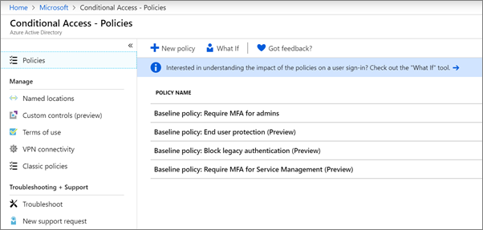

# הגדרת מדיניות גישה מותניתSet up conditional access policies

פריטי מדיניות [גישה מותנית](https://docs.microsoft.com/azure/active-directory/conditional-access/overview) מוסיפים אבטחה משמעותית.[Conditional access](https://docs.microsoft.com/azure/active-directory/conditional-access/overview) policies add substantial additional security. Microsoft מספקת מערכת של פריטי מדיניות גישה מותנית בסיסית המומלצת עבור כל הלקוחות.Microsoft provides a set of baseline conditional access policies that are recommended for all customers. מדיניות בסיסית היא קבוצה של פריטי מדיניות מוגדרים מראש המסייעים להגן על ארגונים מפני התקפות נפוצות רבות.Baseline policies are a set of predefined policies that help protect organizations against many common attacks. התקפות נפוצות אלה יכולות לכלול תרסיס סיסמה, הפעלה חוזרת ודיוג.These common attacks can include password spray, replay, and phishing.

מדיניות זו דורשת ממנהלים ומשתמשים להזין סוג שני של אימות (הנקרא אימות מרובה גורמים או משרד המשנה) כאשר מתקיימים תנאים מסוימים.These policies require admins and users to enter a second form of authentication (called multifactor authentication, or MFA) when certain conditions are met. לדוגמה, אם משתמש נכנס ממדינה אחרת, ייתכן שהכניסה תיחשב כמסוכנת והמשתמש חייב לספק סוג נוסף של אימות.For example, if a user is signing in from a different country, the sign-in might be considered risky and the user must provide an additional form of authentication. 

כעת, מדיניות בסיסית כוללת את הפעולות הבאות:Currently, baseline policies include the following:
- **דרוש למרכז המידע למנהלים** &ndash; מחייב אימות מרובה גורמים עבור תפקידי מנהל המערכת המיוחסים ביותר, כולל מנהל כללי.**Require MFA for admins** &ndash; Requires multi-factor authentication for the most privileged administrator roles, including global administrator.
- &ndash; **הגנת משתמש קצה** מחייבת אימות מרובה גורמים עבור משתמשים רק כאשר כניסה היא מסוכנת.**End user protection** &ndash; Requires multi-factor authentication for users only when a sign-in is risky. 
- &ndash; **חסום אימות מדור קודם** עבור יישומי לקוח ישנים ויישומים חדשים מסוימים אינם משתמשים בפרוטוקולי אימות חדשים ומאובטחים יותר.**Block legacy authentication** &ndash; Older client apps and some new apps don't use newer, more secure, authentication protocols. יישומים ישנים אלה יכולים לעקוף מדיניות גישה מותנית ולהשיג גישה בלתי מורשית לסביבה שלך.These older apps can bypass conditional access policies and gain unauthorized access to your environment. מדיניות זו חוסמת את הגישה מלקוחות שאינם תומכים בגישה מותנית.This policy blocks access from clients that don't support conditional access. 
- דרוש לתואר &ndash; **שירותי משרד לניהול השירות** מחייב אימות רב-גורמי לגישה לכלי ניהול, כולל פורטל התכלת (היכן שתקבע את תצורת מדיניות בסיסית).**Require MFA for Service Management** &ndash; Requires multi-factor authentication for access to management tools, including Azure portal (where you configure baseline policies). 

Microsoft ממליצה להפוך את כל פריטי המדיניות הבסיסיים לזמינים.Microsoft recommends you enable all of these baseline policies. לאחר שפריטי מדיניות אלה מופעלים, מנהלים ומשתמשים יתבקשו להירשם לאימות מרובה הגורמים התכלת.After these policies are enabled, admins and users will be prompted to register for Azure Multii-Factor authentication.

לקבלת מידע נוסף אודות פריטי מדיניות אלה, ראה [מהן מדיניות בסיסית](https://docs.microsoft.com/azure/active-directory/conditional-access/concept-baseline-protection)?For more information about these policies, see [What are baseline policies](https://docs.microsoft.com/azure/active-directory/conditional-access/concept-baseline-protection)?

## הגדרת מדיניות בסיסיתSet up baseline policies

1. עבור אל [הפורטל התכלת](https://portal.azure.com)ונווט אל **הגישה המותנית**של **active Directory** \> .Go to [Azure portal](https://portal.azure.com), and then navigate to **Azure Active Directory** \> **Conditional Access**.
    
    פריטי המדיניות הבסיסיים מפורטים בדף.The baseline policies are listed on the page.    
    
1. עיין בהנחיות הספציפיות הבאות עבור כל מדיניות:See the following specific instructions for each policy:

  - [דרוש את משרד התואר למנהליםRequire MFA for admins](https://docs.microsoft.com/azure/active-directory/conditional-access/howto-baseline-protect-administrators)
- [דרוש משרד למשתמשRequire MFA for users](https://docs.microsoft.com/azure/active-directory/conditional-access/howto-baseline-protect-end-users)  
 - [חסום אימות מדור קודםBlock legacy authentication](https://docs.microsoft.com/azure/active-directory/conditional-access/howto-baseline-protect-legacy-auth)
  - [דרוש תואר שירות למען ניהול השירותRequire MFA for service management](https://docs.microsoft.com/azure/active-directory/conditional-access/howto-baseline-protect-azure)

באפשרותך להגדיר פריטי מדיניות נוספים רבים, כגון דרישת יישומי לקוח מאושרים.You can set up many additional policies, such as requiring approved client apps. לקבלת מידע נוסף, עיין [בתיעוד של גישה מותנית](https://docs.microsoft.com/azure/active-directory/conditional-access/).For more information, see the [Conditional Access Documentation](https://docs.microsoft.com/azure/active-directory/conditional-access/).
