# הגדרת התקנים ניידים עבור Microsoft 365 עבור משתמשים עסקייםSet up mobile devices for Microsoft 365 for business users

בצע את ההוראות בכרטיסיות כדי להתקין את Office ב- iPhone או בטלפון Android.Follow the instructions in the tabs to install Office on an iPhone or an Android phone. לאחר שתבצע את הפעולות הבאות, קבצי העבודה שייווצרו ביישומי Office יהיו מוגנים על-ידי Microsoft 365 עבור עסקים.After you follow these steps, your work files created in Office apps will be protected by Microsoft 365 for business.

הדוגמה מיועדת ל- Outlook, אבל היא חלה על אפליקציות אחרות של Office שברצונך להתקין גם כן.The example is for Outlook, but applies for any other Office apps you want to install also.
  
## הגדרת מכשירים ניידיםSet up mobile devices

## [iPhoneiPhone](#tab/iPhone)
  
צפה בסרטון וידאו קצר על איך להגדיר יישומי Office על התקני iOS עם Microsoft 365 עבור עסקים.Watch a short video on how to set up Office apps on iOS devices with Microsoft 365 for business.  

> [!VIDEO https://www.microsoft.com/videoplayer/embed/RWee2n] 

אם סרטון וידאו זה היה שימושי עבורך, עיין ב[סדרת ההדרכה המלאה עבור עסקים קטנים ומשתמשים חדשים ב- Microsoft 365](https://support.office.com/article/6ab4bbcd-79cf-4000-a0bd-d42ce4d12816).If you found this video helpful, check out the [complete training series for small businesses and those new to Microsoft 365](https://support.office.com/article/6ab4bbcd-79cf-4000-a0bd-d42ce4d12816).

עבור אל **App store**,ובשדה החיפוש הקלד Microsoft Outlook.Go to **App store**, and in the search field type in Microsoft Outlook.
  
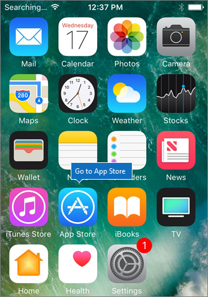
  
הקש על סמל הענן כדי להתקין את Outlook.Tap the cloud icon to install Outlook.
  
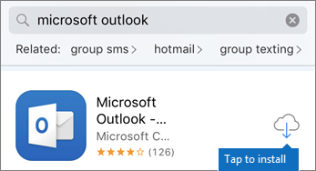
  
לאחר השלמת ההתקנה, הקש על לחצן **פתח** כדי לפתוח את Outlook ולאחר מכן הקש על **תחילת העבודה**.When the installation is done, tap the **Open** button to open Outlook and then tap **Get Started**.
  
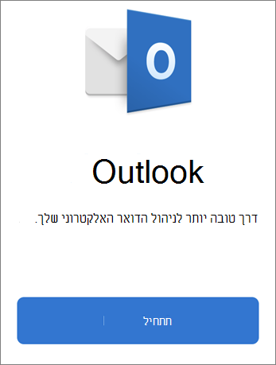
  
הזן את כתובת הדואר האלקטרוני שלך בעבודה בחשבון הוספת המסך של **חשבון הדואר האלקטרוני** \> **Add Account**ולאחר מכן הזן את Microsoft 365 עבור \> **הכניסה**לאישורים עסקיים.Enter your work email address on the **Add Email Account** screen \> **Add Account**, and then enter your Microsoft 365 for business credentials \> **Sign in**.
  
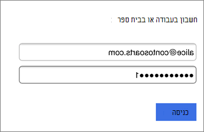
  
אם הארגון שלך מגן על קבצים ביישומים, תראה תיבת דו-שיח המציינת שהארגון שלך מגן כעת על הנתונים ביישום ועליך להפעיל מחדש את היישום כדי להמשיך להשתמש בו.If your organization is protecting files in apps, you'll see a dialog stating that your organization is now protecting the data in the app and you need to restart the app to continue to use it. הקש על **אישור** וסגור את Outlook.Tap **OK** and close Outlook. 
  
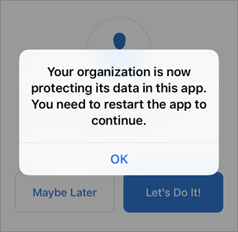
  
אתר את Outlook ב- iPhone והפעל אותו מחדש.Locate Outlook on the iPhone, and restart it. כשתתבקש, הזן PIN ואמת אותו.When prompted, enter a PIN and verify it. Outlook ב- iPhone שלך מוכן כעת לשימוש.Outlook on your iPhone is now ready to be used.
  
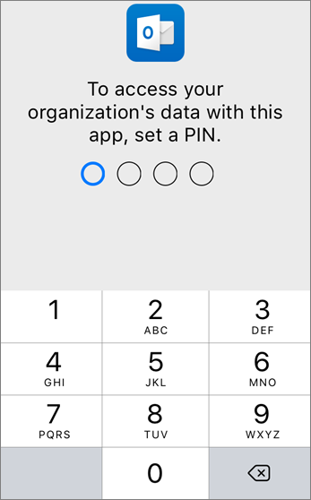
  
## [אנדרואידAndroid](#tab/Android)
  
צפה בסרטון וידאו אודות התקנת Outlook ו-Office על התקנים אנדרואיד.Watch a video about installing Outlook and Office on Android devices.  

> [!VIDEO https://www.microsoft.com/videoplayer/embed/ecc2e9c0-bc7e-4f26-8b14-91d84dbcfef0] 

אם סרטון וידאו זה היה שימושי עבורך, עיין ב[סדרת ההדרכה המלאה עבור עסקים קטנים ומשתמשים חדשים ב- Microsoft 365](https://support.office.com/article/6ab4bbcd-79cf-4000-a0bd-d42ce4d12816).If you found this video helpful, check out the [complete training series for small businesses and those new to Microsoft 365](https://support.office.com/article/6ab4bbcd-79cf-4000-a0bd-d42ce4d12816).

כדי להתחיל בהתקנה בטלפון Android, עבור אל חנות ההפעלה.To begin setup on your Android phone, go to the Play Store.
  
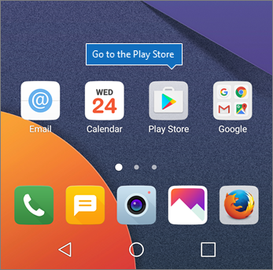
  
היכנס ל-Microsoft Outlook בתיבת החיפוש של Google Play והקש על **התקן**.Enter Microsoft Outlook in the Google Play search box and tap **Install**. לאחר ש-Outlook מבצע התקנה, הקש על **פתח**.Once Outlook is done installing, tap **Open**.
  
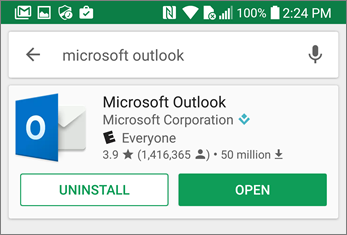
  
ביישום Outlook, הקש על **תחילת**העבודה ולאחר מכן הוסף את מיקרוסופט 365 עבור חשבון הדואר האלקטרוני העסקי שלך \> **להמשיך**, והיכנס עם אישורי הארגון שלך.In the Outlook app, tap **Get Started**, then add your Microsoft 365 for business email account \> **Continue**, and sign in with your organization credentials.
  
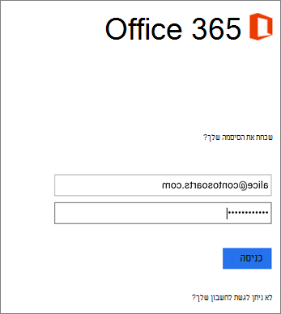
  
בתיבת הדו-שיח המציינת שעליך להתקין את האפליקציה Intune Company Portal, הקש על **עבור לחנות**.In the dialog that states you must install the Intune Company Portal app, tap **Go to store**.
  
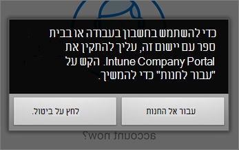
  
בחנות הפעל, התקן Intune החברה פורטל.In Play Store, install Intune Company Portal.
  
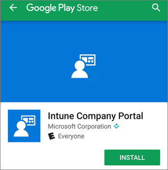
  
פתח את Outlook שוב, הזן ואשר מספר זיהוי אישי. האפליקציה Outlook מוכנה כעת לשימוש.Open Outlook again, and enter and confirm a PIN. Your Outlook app is now ready for use.
  
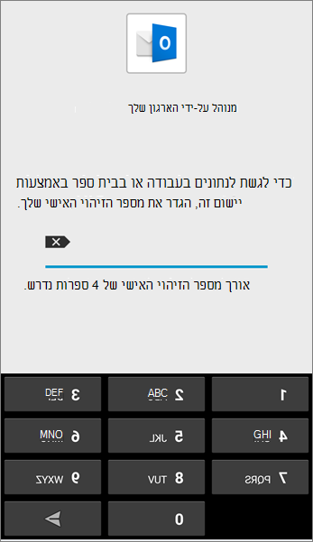

## למידע נוסףSee also

[מיקרוסופט 365 עבור סרטוני הדרכה עסקיתMicrosoft 365 for business training videos](https://support.office.com/article/6ab4bbcd-79cf-4000-a0bd-d42ce4d12816)

---
