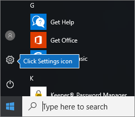
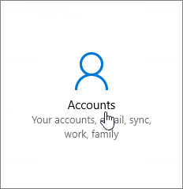
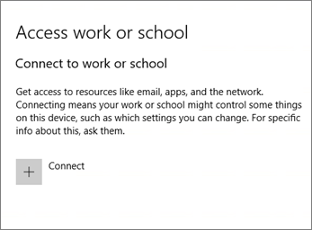
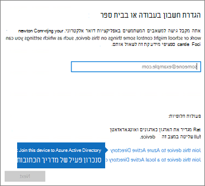
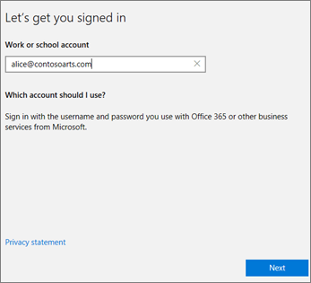
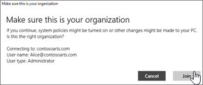
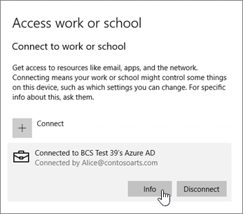
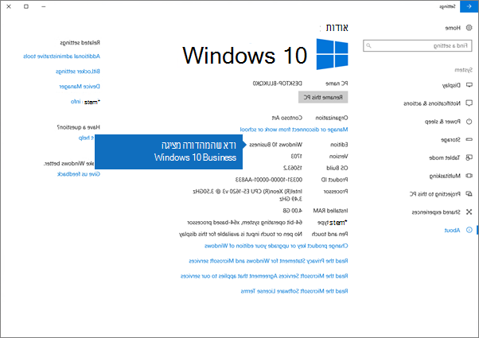

# הגדרת מכשירי Windows עבור משתמשים של Microsoft 365 BusinessSet up Windows devices for Microsoft 365 Business users

## דרישות מוקדמות להגדרת התקני Windows עבור משתמשים עסקיים של Microsoft 365Prerequisites for setting up Windows devices for Microsoft 365 Business users

לפני שתוכל להגדיר מכשירי Windows עבור משתמשי Microsoft 365 Business, ודא שבכל מכשירי Windows פועלת מהדורה 1703 של Windows 10 Pro (העדכון ליוצרים). Windows 10 Pro מהווה דרישה מוקדמת לפריסת Windows 10 Business, שהוא קבוצה של שירותי ענן ויכולות ניהול מכשירים שמשלימות את Windows 10 Pro ומאפשרות את ההפעלה של הניהול המרכזי ובקרות האבטחה של Microsoft 365 Business.Before you can set up Windows devices for Microsoft 365 Business users, make sure all the Windows devices are running Windows 10 Pro, version 1703 (Creators Update). Windows 10 Pro is a prerequisite for deploying Windows 10 Business, which is a set of cloud services and device management capabilities that complement Windows 10 Pro and enable the centralized management and security controls of Microsoft 365 Business.
  
אם יש לך מכשיר Windows עם Windows 7 Pro, ‏Windows 8 Pro או Windows 8.1 Pro, מנוי Microsoft 365 Business שלך מזכה אותך בשדרוג ל- Windows 10.If you have Windows devices running Windows 7 Pro, Windows 8 Pro, or Windows 8.1 Pro, your Microsoft 365 Business subscription entitles you to a Windows 10 upgrade.
  
לקבלת מידע נוסף על שדרוג מכשירי Windows לעדכון Windows 10 ליוצרים, פעל לפי השלבים בנושא זה: [שדרוג מכשירי Windows לעדכון Windows Pro ליוצרים](upgrade-to-windows-pro-creators-update.md).For more information on how to upgrade Windows devices to Windows 10 Pro Creators Update, follow the steps in this topic: [Upgrade Windows devices to Windows Pro Creators Update](upgrade-to-windows-pro-creators-update.md).
  
ראה [אימות ההתקן מחובר לתכלת AD](#verify-the-device-is-connected-to-azure-ad) כדי לוודא שיש לך את השדרוג, או כדי לוודא שהשדרוג עבד.See [Verify the device is connected to Azure AD](#verify-the-device-is-connected-to-azure-ad) to verify you have the upgrade, or to make sure the upgrade worked.

צפה בסרטון וידאו קצר אודות חיבור Windows ל-Microsoft 365.Watch a short video about connecting Windows to Microsoft 365.  

> [!VIDEO https://www.microsoft.com/videoplayer/embed/RE3yXh3] 

אם סרטון וידאו זה היה שימושי עבורך, עיין ב[סדרת ההדרכה המלאה עבור עסקים קטנים ומשתמשים חדשים ב- Microsoft 365](https://support.office.com/article/6ab4bbcd-79cf-4000-a0bd-d42ce4d12816).If you found this video helpful, check out the [complete training series for small businesses and those new to Microsoft 365](https://support.office.com/article/6ab4bbcd-79cf-4000-a0bd-d42ce4d12816).
  
## צירוף מכשירי Windows 10 ל- Azure AD של הארגון שלךJoin Windows 10 devices to your organization's Azure AD

כאשר כל התקני Windows בארגון שלך שודרגו ל-Windows 10 Pro יוצרי עדכון או שכבר פועל Windows 10 Pro יוצרי עדכון, אתה יכול להצטרף התקנים אלה לתוך הארגון שלך הפעיל הספריה.When all Windows devices in your organization have either been upgraded to Windows 10 Pro Creators Update or are already running Windows 10 Pro Creators Update, you can join these devices to your organization's Azure Active Directory. לאחר הצירוף של המכשירים, הם ישודרגו באופן אוטומטי ל-Windows 10 Business, המהווה חלק ממנוי העסקי של Microsoft 365.Once the devices are joined, they'll be automatically upgraded to Windows 10 Business, which is part of your Microsoft 365 Business subscription.
  
### עבור מכשיר Windows 10 Pro חדש לגמרי או ששודרג לאחרונהFor a brand new, or newly upgraded, Windows 10 Pro device

עבור מכשיר חדש לגמרי שעדכון Windows 10 Pro ליוצרים פועל בו, או עבור מכשיר ששודרג לעדכון Windows 10 Pro ליוצרים אך לא הוגדר ל- Windows 10, בצע את השלבים הבאים.For a brand new device running Windows 10 Pro Creators Update, or for a device that was upgraded to Windows 10 Pro Creators Update but has not gone through Windows 10 device setup, follow these steps.
  
1. עבור על פרטי ההגדרה של מכשיר Windows 10 עד שתגיע לעמוד **כיצד ברצונך להגדיר?**.Go through Windows 10 device setup until you get to the **How would you like to set up?** page. 
    
    
  
2. כאן, בחר **הגדרה עבור ארגון** ולאחר מכן הזן את שם המשתמש והסיסמה שלך עבור Microsoft 365 Business.Here, choose **Set up for an organization** and then enter your username and password for Microsoft 365 Business. 
    
3. סיים את הגדרת מכשיר Windows 10.Finish Windows 10 device setup.
    
   כשתסיים, המשתמש יהיה מחובר ל- Azure AD של הארגון שלך. ראה [אימות שהמכשיר מחובר ל- Azure AD](#verify-the-device-is-connected-to-azure-ad) כדי לוודא.Once you're done, the user will be connected to your organization's Azure AD. See [Verify the device is connected to Azure AD](#verify-the-device-is-connected-to-azure-ad) to make sure. 
  
### עבור מכשיר שכבר מוגדר וש- Windows 10 Pro פועל בוFor a device already set up and running Windows 10 Pro

 **חיבור משתמשים ל- Azure AD:****Connect users to Azure AD:**
  
1. במחשב ה- Windows של המשתמש שלך, שפועל בו Windows 10 Pro, גירסה 1703 (עדכון ליוצרים) (ראה [דרישות מוקדמות](pre-requisites-for-data-protection.md)), לחץ על סמל Windows ולאחר מכן על סמל 'הגדרות'.In your user's Windows PC, that is running Windows 10 Pro, version 1703 (Creators Update) (see [pre-requisites](pre-requisites-for-data-protection.md)), click the Windows logo, and then the Settings icon.
  
   
  
2. ב **הגדרות**, עבור אל **חשבונות**.In **Settings**, go to **Accounts**.
  
   
  
3. בדף **המידע שלך**, לחץ על **גישה לחשבון עבודה או בית ספר** \> **התחבר**.On **Your info** page, click **Access work or school** \> **Connect**.
  
   
  
4. בתיבת הדו-שיח **הגדר חשבון בעבודה או בבית ספר**, תחת **פעולות חלופיות**, בחר **צרף מכשיר זה ל- Azure Active Directory**.On the **Set up a work or school account** dialog, under **Alternate actions**, choose **Join this device to Azure Active Directory**.
  
   
  
5. בדף **בוא נבצע את תהליך הכניסה**, הזן את החשבון שלך בעבודה או בבית הספר \> **הבא**.On the **Let's get you signed in** page, enter your work or school account \> **Next**.
  
   בדף **הזנת סיסמה**, הזן את הסיסמה שלך \> **כניסה**.On the **Enter password** page, enter your password \> **Sign in**.
  
   
  
6. ב-ודא שזהו דף **הארגון שלך** , ודא שהמידע נכון ולחץ על **הצטרף**.On the **Make sure this is your organization** page, verify that the information is correct, and click **Join**.
  
   בדף **הכל מוכן!**, לחץ על **סיום**.On the **You're all set!** page, click **Done**.
  
   
  
אם העלית קבצים אל OneDrive for Business, סנכרן אותם בחזרה.If you uploaded files to OneDrive for Business, sync them back down. אם השתמשת בכלי של ספק חיצוני כדי להעביר פרופיל וקבצים, סנכרן גם אותם לפרופיל החדש.If you used a third-party tool to migrate profile and files, also sync those to the new profile.
  
## אימות שהמכשיר מחובר ל- Azure ADVerify the device is connected to Azure AD

כדי לאמת את מצב הסינכרון שלך, בדף **גישה לחשבון עבודה או בית ספר** ב **הגדרות**, לחץ באזור **מחובר ל** _ \<organization name\> _ כדי לחשוף את הלחצנים **מידע** ו **התנתק**. לחץ על **מידע** כדי לקבל את מצב הסינכרון.To verify your sync status, on the **Access work or school** page in **Settings**, click in the **Connected to** _ \<organization name\> _ area to expose the buttons **Info** and **Disconnect**. Click on **Info** to get your synchronization status. 
  
בדף 'מצב סינכרון', לחץ על 'סינכרון' כדי לקבל את פריטי מדיניות הניהול העדכניים ביותר של המכשיר הנייד במחשב ה- PC.On the Sync status page, click Sync to get the latest mobile device management policies onto the PC.
  
כדי להתחיל להשתמש בחשבון העסקי של Microsoft 365, עבור ללחצן **התחל** של Windows, לחץ לחיצה ימנית על תמונת החשבון הנוכחית שלך ולאחר מכן **החלף חשבון**.To start using the Microsoft 365 Business account, go to the Windows **Start** button, right-click your current account picture, and then **Switch account**. היכנס באמצעות הדואר האלקטרוני והסיסמה של הארגון שלך.Sign in by using your organization email and password.
  

  
## אימות שהמכשיר משודרג ל- Windows 10 BusinessVerify the device is upgraded to Windows 10 Business

ודא שמכשירי Windows 10 שהצטרפו ל- Azure AD שודרגו ל- Windows 10 Business כחלק מהמנוי ל- Microsoft 365 Business.Verify that your Azure AD joined Windows 10 devices were upgraded to Windows 10 Business as part of your Microsoft 365 Business subscription.
  
1. עבור אל **הגדרות** \> **מערכת** \> **אודות**.Go to **Settings** \> **System** \> **About**.
    
2. ודא שתחת **מהדורה** מופיע **Windows 10 Business**.Confirm that the **Edition** shows **Windows 10 Business**.
    
    
  
## השלבים הבאיםNext steps

כדי להגדיר את המכשירים הניידים שלך, ראה [הגדרת מכשירים ניידים עבור משתמשי Microsoft 365 Business](set-up-mobile-devices.md). כדי להגדיר כללי מדיניות הגנה למכשירים או ליישומים, ראה [ניהול Microsoft 365 Business](manage.md).To set up your mobile devices, see [Set up mobile devices for Microsoft 365 Business users](set-up-mobile-devices.md), To set device protection or app protection policies, see [Manage Microsoft 365 Business](manage.md).
  
## לקבלת פרטים נוספים על הגדרה ושימוש ב-Microsoft 365 BusinessFor more on setting up and using Microsoft 365 Business

[סרטוני הדרכה בנושא Microsoft 365 BusinessMicrosoft 365 Business training videos](https://support.office.com/article/6ab4bbcd-79cf-4000-a0bd-d42ce4d12816)
