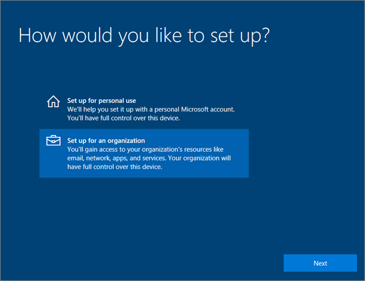

# הגדרת Windows עבור Microsoft 365 Business Premium המשתמשים

## לפני שתתחיל

כדי שתוכל להגדיר Windows עבור משתמשי Microsoft 365 Business Premium, ודא שכל מכשירי Windows פועלים Windows 10 Pro, גירסה 1703 (Creators Update). Windows 10 Pro היא דרישה מוקדמת לפריסת Windows 10 Business, שהיא ערכה של שירותי ענן ויכולות לניהול מכשירים המשלים את Windows 10 Pro ולאפשר את פקדי הניהול והאבטחה המרכזיים של Microsoft 365 Business Premium.
  
אם יש לך Windows פועלים Windows 7 Pro, Windows 8 Pro או Windows 8.1 Pro, המנוי Microsoft 365 Business Premium שלך מקנה לך Windows 10 שדרוג.
  
לקבלת מידע נוסף על שדרוג מכשירי Windows לעדכון Windows 10 ליוצרים, פעל לפי השלבים בנושא זה: [שדרוג מכשירי Windows לעדכון Windows Pro ליוצרים](upgrade-to-windows-pro-creators-update.md).
  
ראה [אימות שהמכשיר מחובר ל- Azure AD](#verify-the-device-is-connected-to-azure-ad) כדי לוודא שהשדרוג מסוים, או כדי לוודא שהשדרוג פעל.

## צפה: התחברות למחשב שלך כדי Microsoft 365 Business

> [!VIDEO https://www.microsoft.com/videoplayer/embed/RE3yXh3] 

אם סרטון וידאו זה היה שימושי עבורך, עיין ב[סדרת ההדרכה המלאה עבור עסקים קטנים ומשתמשים חדשים ב- Microsoft 365](../business-video/index.yml).
  
## צירוף מכשירי Windows 10 ל- Azure AD של הארגון שלך

כאשר כל Windows בארגון שלך שודרגו לעדכון Windows 10 Pro ליוצרים או שכבר פועלים Windows 10 Pro Creators Update, באפשרותך להצטרף למכשירים אלה ל- Azure Active Directory של הארגון שלך. לאחר ההצטרפות של המכשירים, הם ישודררגו באופן אוטומטי ל- Windows 10 Business, שהוא חלק Microsoft 365 Business Premium שלך.
  
### עבור מכשיר Windows 10 Pro חדש לגמרי או ששודרג לאחרונה

עבור מכשיר חדש לגמרי שעדכון Windows 10 Pro ליוצרים פועל בו, או עבור מכשיר ששודרג לעדכון Windows 10 Pro ליוצרים אך לא הוגדר ל- Windows 10, בצע את השלבים הבאים.
  
1. עבור על פרטי ההגדרה של מכשיר Windows 10 עד שתגיע לעמוד **כיצד ברצונך להגדיר?**. 
    
    
  
2. כאן, בחר **הגדר עבור ארגון ולאחר מכן הזן** את שם המשתמש והסיסמה שלך עבור Microsoft 365 Business Premium. 
    
3. סיים את הגדרת מכשיר Windows 10.
    
   כשתסיים, המשתמש יהיה מחובר ל- Azure AD של הארגון שלך. ראה [אימות שהמכשיר מחובר ל- Azure AD](#verify-the-device-is-connected-to-azure-ad) כדי לוודא. 
  
### עבור מכשיר שכבר מוגדר וש- Windows 10 Pro פועל בו

 **חיבור משתמשים ל- Azure AD:**
  
1. במחשב ה- Windows של המשתמש שלך, שפועל בו Windows 10 Pro, גירסה 1703 (עדכון ליוצרים) (ראה [דרישות מוקדמות](pre-requisites-for-data-protection.md)), לחץ על סמל Windows ולאחר מכן על סמל 'הגדרות'.
  
   
  
2. ב **הגדרות**, עבור אל **חשבונות**.
  
   
  
3. בדף **המידע שלך**, לחץ על **גישה לחשבון עבודה או בית ספר** \> **התחבר**.
  
   
  
4. בתיבת הדו-שיח **הגדר חשבון בעבודה או בבית ספר**, תחת **פעולות חלופיות**, בחר **צרף מכשיר זה ל- Azure Active Directory**.
  
   
  
5. בדף **בוא נבצע את תהליך הכניסה**, הזן את החשבון שלך בעבודה או בבית הספר \> **הבא**.
  
   בדף **הזנת סיסמה**, הזן את הסיסמה שלך \> **כניסה**.
  
   
  
6. בדף **ודא שזהו הארגון שלך,** ודא שהמידע נכון ובחר **הצטרף.**
  
   ב- **אתה מוכן!** page, chosse **Done**.
  
   
  
אם העלית קבצים אל OneDrive for Business, סנכרן אותם בחזרה. אם השתמשת בכלי של ספקים אחרים להעברת פרופיל וקבצים, סנכרן גם אותם עם הפרופיל החדש.
  
## אימות שהמכשיר מחובר ל- Azure AD

כדי לאמת את מצב הסינכרון שלך, **בדף Access** בעבודה או בבית ספר **ב- הגדרות**, בחר באזור **מחובר** ל_ _ כדי לחשוף את \<organization name\> הלחצנים מידע **והתנתק.**  בחר **מידע כדי** לקבל את מצב הסינכרון שלך. 
  
בדף מצב **סינכרון,** בחר **סנכרן** כדי לקבל את מדיניות הניהול העדכנית ביותר של מכשירים ניידים למחשב.
  
כדי להתחיל להשתמש בחשבון Microsoft 365 Business Premium, עבור אל לחצן Windows **התחל,** לחץ באמצעות לחצן העכבר הימני על תמונת החשבון הנוכחית ולאחר מכן **עבור לחשבון**. היכנס באמצעות הדואר האלקטרוני והסיסמה של הארגון שלך.
  

  
## ודא שהמחשב משודרג ל- Windows 10 Business

ודא שהתקני Azure AD המצורפים Windows 10 שלך משודרגים ל- Windows 10 Business כחלק Microsoft 365 Business Premium שלך.
  
1. עבור אל **הגדרות** \> **מערכת** \> **אודות**.
    
2. ודא שתחת **מהדורה** מופיע **Windows 10 Business**.
    
    
  
## השלבים הבאים

כדי להגדיר את המכשירים הניידים שלך, ראה הגדרת [מכשירים ניידים עבור משתמשי Microsoft 365 Business Premium](set-up-mobile-devices.md), כדי להגדיר מדיניות הגנה על מכשירים או הגנה [על יישומים, ראה ניהול Microsoft 365 לעסקים.](manage.md)
  
## תוכן קשור

[Microsoft 365 הדרכה לעסקים](../business-video/index.yml) (דף קישור)
