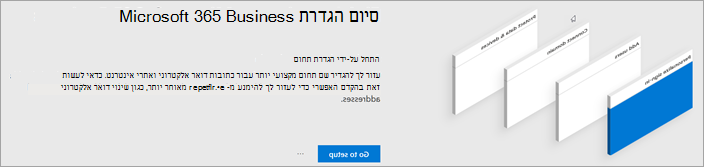
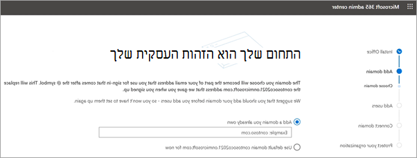
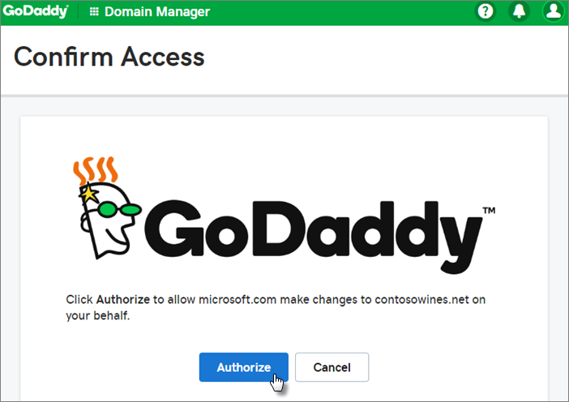
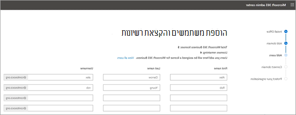
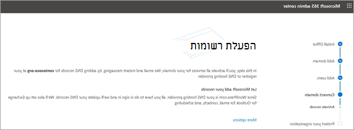
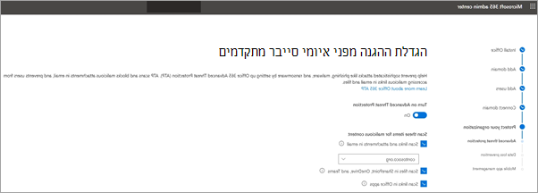
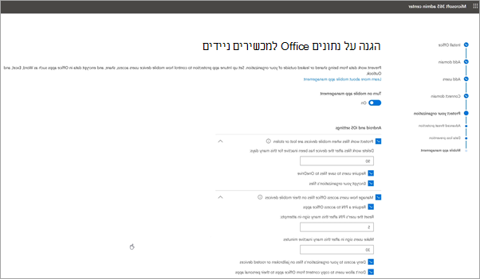

# הגדרת Microsoft 365 Business Premium באשף ההגדרה

צפה בסרטון וידאו זה לקבלת מבט כולל על התקנת Microsoft 365 Business Premium.  

> [!VIDEO https://www.microsoft.com/videoplayer/embed/RE4jZwg] 

## הוספת התחום, המשתמשים ומדיניות ההגדרה

כאשר אתה רוכש את Microsoft 365 Business Premium, באפשרותך להשתמש בתחום שבבעלותך או לקנות אותו במהלך [ההרשמה](sign-up.md).

- אם רכשת תחום חדש כאשר נרשמת, התחום שלך מוגדר כולו ובאפשרותך לעבור [להוספת משתמשים ולהקצות רשיונות](#add-users-and-assign-licenses).

### הוספת התחום שלך להתאמה אישית של כניסה

1. היכנס אל [מרכז הניהול של Microsoft 365](https://admin.microsoft.com) באמצעות אישורי מנהל המערכת הכלליים שלך. 

2. בחר **עבור אל תוכנית ההתקנה** כדי להפעיל את האשף.

    

3. בדף **התקן את יישומי Office שלך** , באפשרותך להתקין את היישומים במחשב שלך באופן אופציונלי.
    
4. בשלב **הוספת תחום** , הזן את שם התחום שבו ברצונך להשתמש (כגון contoso.com).

    > [!IMPORTANT]
    > אם רכשת תחום במהלך ההרשמה, לא תראה את האפשרות **הוסף שלב זה לתחום** . עבור אל [הוספת משתמשים](#add-users-and-assign-licenses) במקום זאת.

    

    
4. בצע את השלבים באשף כדי [ליצור רשומות dns בכל ספק אירוח dns עבור Microsoft 365](/office365/admin/get-help-with-domains/create-dns-records-at-any-dns-hosting-provider) שמאמת את בעלותך על התחום. אם אתה מכיר את מארח התחום שלך, ראה גם [הוראות ספציפיות למארח](/office365/admin/get-help-with-domains/set-up-your-domain-host-specific-instructions).

    אם ספק האירוח שלך הוא GoDaddy או מארח אחר זמין עם ' [חיבור לתחומים](/office365/admin/get-help-with-domains/domain-connect)', התהליך קל וברצונך להיכנס באופן אוטומטי ולאפשר ל-Microsoft לאמת בשמך.

    

### הוספת משתמשים והקצאת רשיונות

באפשרותך להוסיף משתמשים באשף, אך באפשרותך גם [להוסיף משתמשים בהמשך](../admin/add-users/add-users.md) מרכז הניהול. בנוסף, אם יש לך בקר תחום מקומי, באפשרותך להוסיף משתמשים בעלי [התחברות של תכלת לספירה](/azure/active-directory/hybrid/how-to-connect-install-express).

#### הוספת משתמשים באשף

כל המשתמשים שתוסיף באשף יוקצה באופן אוטומטי רשיון של Microsoft 365 Business Premium.

1. אם המנוי שלך ל-Microsoft 365 Business Premium מכיל משתמשים קיימים (לדוגמה, אם השתמשת בחיבור של תכלת לספירה), אתה מקבל אפשרות להקצות להם רשיונות כעת. קדימה, הוסף רשיונות גם להם.

2. לאחר שהוספת את המשתמשים, תקבל גם אפשרות לשתף אישורים עם המשתמשים החדשים שהוספת. באפשרותך להדפיס אותם, לשלוח אותם בדואר אלקטרוני או להוריד אותם.

### חיבור התחום שלך

> [!NOTE]
> אם בחרת להשתמש בתחום. onmicrosoft, או השתמש ב-תכלת AD Connect כדי להגדיר משתמשים, לא תראה שלב זה.
  
להגדרת שירותים, עליך לעדכן כמה רשומות אצל מארח ה- DNS שלך או אצל רשם התחומים.
  
1. אשף ההגדרה מזהה בדרך כלל את הרשם שלך, ומספק לך קישור להוראות מפורטות לעדכון רשומות ה- NS באתר האינטרנט של הרשם. אם היא אינה [מופיעה, שנה את nameservers כדי להגדיר את Microsoft 365 עם רשם תחומים כלשהו](../admin/get-help-with-domains/change-nameservers-at-any-domain-registrar.md). 

    - אם יש לך רשומות DNS קיימות, למשל אתר אינטרנט קיים, אך מארח ה-DNS שלך מופעל עבור ' [חיבור תחום](/office365/admin/get-help-with-domains/domain-connect)', בחר ' **הוסף רשומות עבורי**'. בדף **בחירת שירותים מקוונים** , קבל את כל ברירות המחדל ובחר **הבא**, ובחר **הרשאה** בעמוד של מארח ה-DNS שלך.
    - אם יש לך רשומות DNS קיימות עם מארחי DNS אחרים (שאינם זמינים עבור ' חיבור תחום '), מומלץ לנהל רשומות DNS משלך כדי לוודא שהשירותים הקיימים נשארים מחוברים. ראה [יסודות תחום](/office365/admin/get-help-with-domains/dns-basics) לקבלת מידע נוסף.

        

2. בצע את השלבים באשף ובדואר האלקטרוני ושירותים אחרים יוגדרו עבורך.

### הגנה על הארגון שלך 

המדיניות שתגדיר באשף מוחלת באופן אוטומטי על [קבוצת אבטחה](/office365/admin/create-groups/compare-groups#security-groups) הנקראת *כל המשתמשים*. באפשרותך גם ליצור קבוצות נוספות כדי להקצות פריטי מדיניות למרכז הניהול.

1. בנושא **הגדלת ההגנה מפני איומי סייבר מתקדמים**, מומלץ לקבל את ברירות המחדל כדי לאפשר [להגנת האיום של office 365](../security/defender-365-security/defender-for-office-365.md) לסרוק קבצים וקישורים ביישומי office.

    

2. בדף **מנע הדלפות של נתונים רגישים** , קבל את ברירות המחדל להפעלת מניעת אובדן נתונים של office 365 (DLP) כדי לעקוב אחר נתונים רגישים ביישומי office ולמנוע את השיתוף המקרי של הקבצים האלה מחוץ לארגון שלך.

3. בדף ' **הגנה על נתונים ב-Office למכשירים ניידים** ', השאר את ' ניהול אפליקציות למכשירים ניידים ', הרחב את ההגדרות וסקור אותן ולאחר מכן בחר באפשרות **צור מדיניות ניהול אפליקציות למכשירים ניידים**.

    

## מחשבי Pc של Windows 10 מאובטחים

בסרגל הניווט הימני, בחר **הגדרה** ולאחר מכן, תחת **כניסה ואבטחה**, בחר **Secure Windows 10 מחשבים**. בחר **' תצוגה** ' כדי להתחיל בעבודה. ראה [Secure Windows 10 מחשבים](secure-win-10-pcs.md) לקבלת הוראות מלאות.

## פריסת יישומי לקוח של Office 365

אם בחרת להתקין באופן אוטומטי את יישומי Office במהלך ההתקנה, היישומים יותקנו במכשירי Windows 10 לאחר שהמשתמשים נכנסו לאזור התכלת לספירה ממכשירי Windows שלהם, תוך שימוש באישורי העבודה שלהם.

כדי להתקין את Office במכשירים ניידים של iOS או Android, ראה [הגדרת מכשירים ניידים עבור משתמשי Microsoft 365 Business Premium](set-up-mobile-devices.md).

באפשרותך גם להתקין את Office בנפרד. ראה [התקנת Office במחשב PC או Mac](https://support.microsoft.com/office/4414eaaf-0478-48be-9c42-23adc4716658) לקבלת הוראות.

## למידע נוסף

[סרטוני וידאו של הדרכה של Microsoft 365 for business](https://support.microsoft.com/office/6ab4bbcd-79cf-4000-a0bd-d42ce4d12816)
