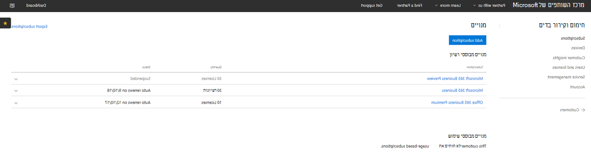

# מעבר של Microsoft 365 CSP עסקי

אם יש לך מנוי CSP Microsoft 365 Business Preview, בצע מדריך זה כדי לגלות כיצד ניתן להעביר את מנוי התצוגה המקדימה הקיים שלך ל- Microsoft 365 Business GA (זמינות כללית).

**כיצד להעביר מנוי תצוגה מקדימה ל- GA**

1. היכנס למרכז <a href="https://partnercenter.microsoft.com" target="_blank">השותפים</a>.
2. מתוך לוח המחוונים, **בחר לקוחות** ולאחר מכן חפש ובחר את שם החברה.

    המנויים עבור החברה יופיעו ברשימה.

    
    
3. בדף מנויים של **החברה,** בחר **הוסף מנוי.**
4. בדף מנוי **חדש,** בחר **עסק קטן** ולאחר מכן **בחר Microsoft 365 Business** מהרשימה.
5. הוסף את מספר הרשיונות ולאחר מכן בחר **הבא: סקירה** כדי לסקור את המנוי ולאחר מכן בחר **שלח**.

    

    המנויים **המבוססים על רשיון מראים** **את Microsoft 365 Business Preview** **ו- Microsoft 365 Business**. לאחר מכן תשעה את מנוי Preview.

6. בחר **Microsoft 365 Business Preview**.
7. בדף תצוגה **Microsoft 365 Business Preview,** בחר **מושעה כדי להשעות** את מנוי Preview.

    

8. בחר **שלח** כדי לאשר.

    בדף **מנויים,** ודא שמצב התצוגה **המקדימה של Microsoft 365 Business מציג** את **מושעה.**

    

9. לחלופין, באפשרותך גם לאמת את הסכם הרשיון. לשם כך, בצע את הפעולות הבאות:
    1. בחר **משתמשים ורשיון** מהדף **מנויים של** החברה.
    2. בדף **משתמשים ורשיון,** בחר משתמש.
    3. בדף של המשתמש, בדוק את המקטע **הקצאת רשיונות** ואשר שהוא מציג **את Microsoft 365 Business**.

        

## השפעה על לקוחות ומשתמשים במהלך המעבר ואחריו

אין השפעה על לקוחות ומשתמשים במהלך מעבר ופרסום מעבר.

## השפעה על לקוחות שלא ומעברים

הטבלה הבאה מסכמת את ההשפעה ללקוחות שלא ומעבר ממנוי של Microsoft 365 Business Preview למנוי Microsoft 365 Business.

|       | T-0 עד T+30     | T+30 עד T+60 | T+60 עד T+120 | Beyond T+120  |
|-------|-----------------|--------------|---------------|---------------|
| **מצב** | בתקופת חסד | פג תוקף      | לא זמין      | Deprovisioned |
| **השפעות שירות**                                                        |
| **מרכז הניהול של Microsoft 365** | אין השפעה על הפונקציונליות | אין השפעה על הפונקציונליות | יכול להוסיף/למחוק משתמשים, לרכוש מנויים.  לא ניתן להקצות/לבטל רשיונות. | המנוי של הלקוח וכל הנתונים נמחקים. מנהל מערכת יכול לנהל מנויים אחרים בתשלום. |
| **Office אפליקציות**                         | אין השפעה על משתמש קצה | אין השפעה על משתמש קצה | Office נכנס למצב פונקציונליות מופחתת.  משתמשים יכולים להציג קבצים בלבד. | Office נכנס למצב פונקציונליות מופחתת.  משתמשים יכולים להציג קבצים בלבד. |
| **שירותי ענן (SharePoint Online, Exchange Online, Skype, Teams ועוד)** | אין השפעה על משתמש קצה | אין השפעה על משתמש קצה | למשתמשי קצה ומנהלי מערכת אין גישה לנתונים בענן. | המנוי של הלקוח וכל הנתונים נמחקים. |
| **רכיבי EM+S** | אין השפעה על מנהל מערכת  אין השפעה על משתמש קצה | אין השפעה על מנהל מערכת  אין השפעה על משתמש קצה | היכולת אינה נאכפת עוד.  לקבלת [מידע נוסף, ראה השפעות על](#mobile-device-impacts-upon-subscription-expiration) מכשיר נייד על [תפוגת המנוי Windows 10 על תפוגת](#windows-10-pc-impacts-upon-subscription-expiration) המנוי. | היכולת אינה נאכפת עוד.  לקבלת [מידע נוסף, ראה השפעות על](#mobile-device-impacts-upon-subscription-expiration) מכשיר נייד על [תפוגת המנוי Windows 10 על תפוגת](#windows-10-pc-impacts-upon-subscription-expiration) המנוי. |
| **Windows 10 Business** | אין השפעה על מנהל מערכת  אין השפעה על משתמש קצה | אין השפעה על מנהל מערכת  אין השפעה על משתמש קצה | היכולת אינה נאכפת עוד.  לקבלת [מידע נוסף, ראה השפעות על](#mobile-device-impacts-upon-subscription-expiration) מכשיר נייד על [תפוגת המנוי Windows 10 על תפוגת](#windows-10-pc-impacts-upon-subscription-expiration) המנוי. | היכולת אינה נאכפת עוד.  לקבלת [מידע נוסף, ראה השפעות על](#mobile-device-impacts-upon-subscription-expiration) מכשיר נייד על [תפוגת המנוי Windows 10 על תפוגת](#windows-10-pc-impacts-upon-subscription-expiration) המנוי. |
| **כניסה ל- Azure AD למחשב Windows 10 PC** | אין השפעה על מנהל מערכת  אין השפעה על משתמש קצה | אין השפעה על מנהל מערכת  אין השפעה על משתמש קצה | אין השפעה על מנהל מערכת  אין השפעה על משתמש קצה | לאחר מחיקת הדייר, משתמש יכול להיכנס עם אישורים מקומיים בלבד. תדמינו מחדש את המכשיר אם אין אישורים מקומיים. |

## המכשיר הנייד משפיע על תפוגת המנוי

הטבלה הבאה מסכמת את ההשפעה על מדיניות ניהול היישומים במכשירים ניידים.

|                            | חוויה עם רשיון מלא                      | T+60 ימים לאחר תפוגת          |
|----------------------------|------------------------------------------------|------------------------------------|
| **מחיקת קבצי עבודה ממכשיר לא פעיל** | קבצי עבודה מוסרים לאחר הימים שנבחרו | קבצי עבודה נשארים במכשירים האישיים של המשתמש |
| **אלץ משתמשים לשמור את כל קבצי העבודה ב- OneDrive for Business** | ניתן לשמור קבצי עבודה רק ב- OneDrive for Business | ניתן לשמור קבצי עבודה בכל מקום |
| **הצפן קבצי עבודה** | קבצי עבודה מוצפנים | קבצי עבודה אינם מוצפנים עוד.  פריטי מדיניות אבטחה מוסרים Office נתונים באפליקציות מוסרים. |
| **דרוש מספר זיהוי אישי או טביעת אצבע כדי לגשת Office יישומים** | גישה מוגבלת לאפליקציות | אין מגבלת גישה ברמת היישום |
| **איפוס מספר זיהוי אישי כאשר הכניסה נכשלת** | גישה מוגבלת לאפליקציות | אין מגבלת גישה ברמת היישום |
| **דרוש מהמשתמשים להיכנס שוב לאחר Office היישומים לא פעילים** | נדרשת כניסה | אין צורך להיכנס |
| **מנע גישה לקבצי עבודה במכשירים שנפרצו או שבוצעה בהם פעולת ROOT** | לא ניתן לגשת לקבצי עבודה במכשירים מסוג jailbroken/rooted | ניתן לגשת לקבצי עבודה במכשירים מסוג jailbroken/rooted |
| **אפשר למשתמשים להעתיק תוכן מאפליקציות Office לאפליקציות אישיות** | העתקה/הדבקה מוגבלת לאפליקציות הזמינות כחלק Microsoft 365 מנוי | העתק/הדבק זמין לכל האפליקציות |

## Windows 10 השפעות מחשב בעת תפוגת המנוי

הטבלה הבאה מסכמת את ההשפעה על מדיניות Windows 10 תצורת המכשיר.

|                            | חוויה עם רשיון מלא                      | T+60 ימים לאחר תפוגת          |
|----------------------------|------------------------------------------------|------------------------------------|
| **עזור להגן על מחשבים מפני איומים באמצעות Windows Defender** | הפעלה/ביטול נמצאת מחוץ לבקרת המשתמש | המשתמש יכול להפעיל/לבטל Windows Defender במחשב Windows 10 שלך |
| **עזור בהגנה על מחשבים מפני איומים מבוססי-אינטרנט ב- Microsoft Edge** | הגנה על מחשב Microsoft Edge | המשתמש יכול להפעיל/לבטל הגנה על מחשב Microsoft Edge |
| **כבה את מסך המכשיר כאשר הוא לא פעיל** | מנהל המערכת מגדיר מדיניות מרווח זמן קצוב למסך | ניתן לקבוע את התצורה של זמן קצוב למסך על-ידי משתמש קצה |
| **אפשר למשתמשים להוריד אפליקציות מ- Microsoft Store** | מנהל המערכת מגדיר אם משתמש יכול להוריד אפליקציות מ- Microsoft Store | המשתמש יכול להוריד אפליקציות Microsoft Store בכל עת |
| **אפשר למשתמשים לגשת ל- Cortana** | מנהל המערכת מגדיר מדיניות על גישת משתמש Cortana | מכשירי משתמש ל הפעלה/ביטול של Cortana |
| **אפשר למשתמשים לקבל עצות ופרסומות מ- Microsoft** | מנהל המערכת מגדיר מדיניות לגבי המשתמשים מקבלים עצות ופרסומות מ- Microsoft | המשתמש יכול להפעיל/לבטל עצות ופרסומות מ- Microsoft |
| **אפשר למשתמשים להעתיק תוכן מאפליקציות Office לאפליקציות אישיות** | מנהל המערכת מגדיר מדיניות Windows 10 מכשירים עדכניים | המשתמשים יכולים להחליט מתי לעדכן Windows |
