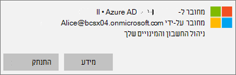
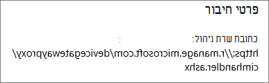
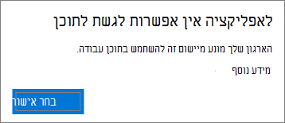
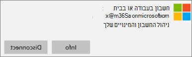
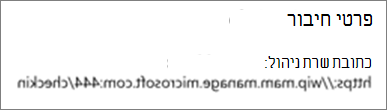

# אימות הגדרות הגנה של אפליקציות במחשבי Windows 10

## ודא שמשתמשים אינם יכולים להעתיק נתונים של החברה לקבצים אישיים במכשירים של החברה

לאחר שאתה [מגדיר מדיניות הגנה על אפליקציות](protection-settings-for-windows-10-devices.md), עשויות לחלוף כמה שעות בטרם המדיניות תיכנס לתוקף במכשירים של המשתמשים. אם הפכת את **ההגדרה** מנע ממשתמשים להעתיק נתוני חברה לקבצים אישיים ולאלץ אותם לשמור קבצי **עבודה ב- OneDrive for Business** עבור מכשירים בבעלות החברה, באפשרותך לבדוק זאת במכשיר של המשתמש לאחר שהם התחברו ל- Azure AD והינם מחוברים. 
  
 **אימות הגדרות חיבור**
  
1. לאחר שתיתחבר באמצעות Microsoft 365 Business Premium ותתחבר ל- Azure AD כמתואר במאמר [הגדרת Windows עבור משתמשי Microsoft 365 Business Premium](set-up-windows-devices.md), עבור אל Windows הגדרות  \> **חשבונות** Access עבודה או \> **בית ספר**. בחר **מחובר \<tenant name\> ל- Azure AD** ולאחר מכן בחר **מידע**.
    
    
  
2. בדף **מנוהל על-ידי,** באפשרותך לראות את פרטי החיבור הכוללים כתובת \<tenant name\> שרת **ניהול,** כמו זו המוצגת באיור הבא.  
    
    
  
 **ודא שלא ניתן להדביק נתוני חברה באפליקציה לא מנוהלת**
  
1. פתח Outlook 2016 שהותקן על-ידי Microsoft 365 Business Premium.
    
2. פתח הודעת דואר אלקטרוני והעתק חלק מהתוכן שלה.
    
    פתח את 'פנקס רשימות' ונסה להדביק את התוכן.
    
    תקבל שגיאה המציין שלאפליקציה אין אפשרות לגשת לתוכן.
    
    
  
    עם זאת, תוכל להדביק את אותו תוכן ב- Word 2016.
    
## ודא שמשתמשים אינם יכולים להעתיק נתונים של החברה לקבצים אישיים במכשירים אישיים

 **אימות הגדרות חיבור**
  
1. במכשיר Windows 10 האישי שלך שבו אתה מחובר כמשתמש מקומי, עבור **אל Windows הגדרות** ולאחר מכן לחץ או הקש על **חשבונות** Access בעבודה או \> **בבית ספר**.
    
2. תחת **גישה לחשבון בעבודה או בבית ספר**, בחר **התחבר**.
    
3. הזן את Microsoft 365 Business Premium האישור שלך בתיבת **הדו-שיח הגדרת חשבון בעבודה או בבית ספר** \> **היכנס.**
    
4. בדף **גישה לחשבון בעבודה או בבית ספר**, בחר את ה **חשבון בעבודה או בבית ספר** ולאחר מכן בחר **פרטים**.
    
    
  
5. בדף **Access בעבודה** או בבית ספר, באפשרותך  לראות את פרטי החיבור הכוללים כתובת **שרת** ניהול, כמו זו המוצגת באיור הבא, וכוללת את המילים *wip* *ו- mam* בתוך. 
    
    
  
 **ודא שלא ניתן להדביק נתוני חברה באפליקציה לא מנוהלת**
  
1. פתח Outlook 2016 והוסף את Microsoft 365 Business Premium שלך במקרה הצורך והירשם באמצעות אישורי Microsoft 365 Business Premium שלך.
    
2. פתח הודעת דואר אלקטרוני והעתק חלק מהתוכן שלה.
    
    פתח את 'פנקס רשימות' ונסה להדביק את התוכן.
    
    תקבל שגיאה שמציין ש- App לא יכול לגשת לתוכן.
    
    
  
    עם זאת, תוכל להדביק את אותו תוכן ב- Word 2016.
    

