# אימות הגדרות הגנה app על אנדרואיד או מכשירי iOSValidate app protection settings on Android or iOS devices

בצע את ההוראות בסעיפים הבאים כדי לאמת הגדרות הגנה app על אנדרואיד או מכשירי iOS.Follow the instructions in the following sections to validate app protection settings on Android or iOS devices.
  
## אנדרואידAndroid
  
### בדוק שהגדרות הגנת היישום עובדות על התקני משתמשCheck that the app protection settings are working on user devices

לאחר [קביעת תצורות של יישומים עבור מכשירי Android](app-protection-settings-for-android-and-ios.md) כדי להגן על יישומים, ניתן לבצע את השלבים הבאים כדי לאמת שההגדרות שבחרת פועלות.After you [set app configurations for Android devices](app-protection-settings-for-android-and-ios.md) to protect the apps, you can follow these steps to validate that the settings you chose work. 
  
ראשית, ודא שהמדיניות חלה על היישום שבו אתה עומד לאמת אותו.First, make sure that the policy applies to the app in which you're going to validate it.
  
1. ב[מרכז הניהול](https://portal.office.com) של Microsoft 365 Business, עבור אל **פריטי מדיניות** \> **ערוך מדיניות**.In the Microsoft 365 Business [admin center](https://portal.office.com), go to **Policies** \> **Edit policy**.
    
2. בחר **מדיניות יישום עבור Android** עבור ההגדרות שיצרת בתוכנית ההתקנה, או מדיניות אחרת שיצרת וודא שהיא נאכפת עבור Outlook, לדוגמה.Choose **Application policy for Android** for the settings you created at setup, or another policy you created, and verify that it's enforced for Outlook, for example. 
    
    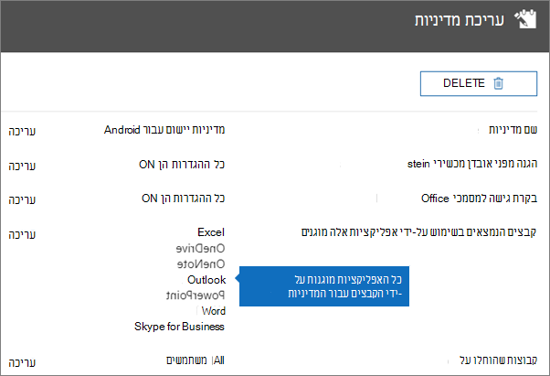
  
### אימות של 'דרוש מספר זיהוי אישי או טביעת אצבע כדי לגשת ליישומי Office'Validate Require a PIN or a fingerprint to access Office apps

בחלונית **ערוך מדיניות**, בחר **ערוך** לצד **בקרת גישה למסמכי Office**, הרחב את **קבע כיצד משתמשים ניגשים לקבצי Office במכשירים ניידים**, וודא שהאפשרות **דרוש מספר זיהוי אישי או טביעת אצבע כדי לגשת ליישומי Office** מוגדרת ל **מופעל**.In the **Edit policy** pane, choose **Edit** next to **Office documents access control**, expand **Manage how users access Office files on mobile devices**, and make sure that **Require a PIN or fingerprint to access Office apps** is set to **On**.
  
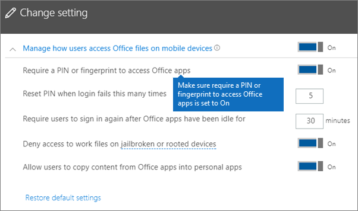
  
1. במכשיר ה- Android של המשתמש, פתח את Outlook והיכנס באמצעות אישורי Microsoft 365 Business של המשתמש.In the user's Android device, open Outlook and sign in with the user's Microsoft 365 Business credentials.
    
2. תתבקש גם להזין PIN או להשתמש בטביעת אצבע.You'll also be prompted to enter a PIN or use a fingerprint.
    
    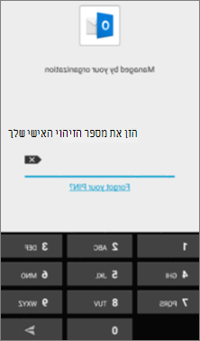
  
### אימות של 'אפס מספר זיהוי אישי כשהכניסה נכשלת מספר פעמים זה'Validate Reset PIN after number of failed attempts

בחלונית ' **עריכת מדיניות** ', בחר ' **עריכה** ' לצד **בקרת גישה למסמכי Office**, הרחב את **ניהול האופן שבו משתמשים ניגשים לקבצי OFFICE בהתקנים ניידים**וודא **שפין איפוס לאחר מספר הנסיונות הכושלים** מוגדר כמספר מסוים.In the **Edit policy** pane, choose **Edit** next to **Office documents access control**, expand **Manage how users access Office files on mobile devices**, and make sure that **Reset PIN after number of failed attempts** is set to some number. . זה 5 כברירת מחדלThis is 5 by default. 
  
1. במכשיר ה- Android של המשתמש, פתח את Outlook והיכנס באמצעות אישורי Microsoft 365 Business של המשתמש.In the user's Android device, open Outlook and sign in with the user's Microsoft 365 Business credentials.
    
2. הזן מספר זיהוי אישי שגוי כמספר הפעמים שצוין על-ידי המדיניות.Enter an incorrect PIN as many times as specified by the policy. תראה הודעה שמציינת את **מגבלת ניסיון של pin הושגה** כדי לאפס את ה-PIN.You'll see a prompt that states **PIN Attempt Limit Reached** to reset the PIN. 
    
    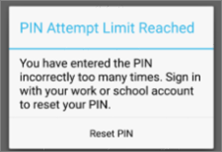
  
3. לחץ על **איפוס מספר זיהוי אישי**.Press **Reset PIN**. תתבקש להיכנס עם האישורים העסקיים של Microsoft 365 של המשתמש ולאחר מכן להגדיר PIN חדש.You'll be prompted to sign in with the user's Microsoft 365 Business credentials, and then required to set a new PIN.
    
### אימות של 'כפה על משתמשים לשמור את כל קבצי העבודה ב- OneDrive for Business'Validate Force users to save all work files to OneDrive for Business

בחלונית **ערוך מדיניות**, בחר **ערוך** לצד **הגנה מפני מכשירים שאבדו או נגנבו**, הרחב את **הגן על קבצי עבודה כאשר מכשירים אובדים או נגנבים**, וודא שהאפשרות **כפה על משתמשים לשמור את כל קבצי העבודה ב- OneDrive for Business** מוגדרת ל **מופעל**.In the **Edit policy** pane, choose **Edit** next to **Protection against lost or stolen devices**, expand **Protect work files when devices are lost or stolen**, and make sure that **Force users to save all work files to OneDrive for Business** is set to **On**.
  
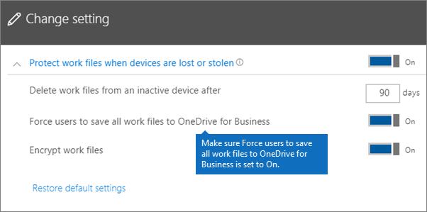
  
1. במכשיר ה- Android של המשתמש, פתח את Outlook והיכנס באמצעות אישורי Microsoft 365 Business של המשתמש והזן מספר זיהוי אישי במידת הצורך.In the user's Android device, open Outlook and sign in with the user's Microsoft 365 Business credentials, and enter a PIN if requested.
    
2. פתח הודעת דואר אלקטרוני המכילה קובץ מצורף והקש על סמל החץ למטה לצד המידע אודות הקובץ המצורף.Open an email that contains an attachment and tap the down arrow icon next to the attachment's information.
    
    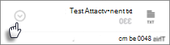
  
    תראה **אין אפשרות לשמור את ההתקן** בתחתית המסך.You'll see **Cannot save to device** on the bottom of the screen. 
    
    
  
    > [!NOTE]
    > [!הערה] שמירה ב- OneDrive for Business אינה זמינה עבור Android בשלב זה, לכן תוכל לראות רק ששמירה מקומית נחסמת.Saving to OneDrive for Business is not enabled for Android at this time, so you can only see that saving locally is blocked. 
  
### אימות של 'דרוש מהמשתמשים להיכנס שוב לאחר שיישומי Office היו לא פעילים במשך'Validate Require user to sign in again if Office apps have been idle for a specified time

בחלונית **המדיניות edit** , בחר באפשרות **ערוך** לצד **בקרת גישה למסמכי Office**, הרחב את **ניהול האופן שבו משתמשים ניגשים לקבצי Office בהתקנים ניידים**וודא **שדרוש למשתמשים להיכנס שוב לאחר שיישומי office לא היו במצב פעיל** מוגדר כמספר דקות מסוים.In the **Edit policy** pane, choose **Edit** next to **Office documents access control**, expand **Manage how users access Office files on mobile devices**, and make sure that **Require users to sign in again after Office apps have been idle for** is set to some number of minutes. . זה 30 דקות כברירת מחדלThis is 30 minutes by default. 
  
1. במכשיר ה- Android של המשתמש, פתח את Outlook והיכנס באמצעות אישורי Microsoft 365 Business של המשתמש והזן מספר זיהוי אישי במידת הצורך.In the user's Android device, open Outlook and sign in with the user's Microsoft 365 Business credentials, and enter a PIN if requested.
    
2. כעת אתה אמור לראות את תיבת הדואר הנכנס של Outlook. הנח למכשיר ה- Android ואל תיגע בו במשך 30 דקות לפחות (או פרק זמן אחר, ארוך יותר מזה שצוין במדיניות). סביר להניח שהמכשיר יהפוך למעומעם.You should now see Outlook's inbox. Let the Android device idle untouched for at least 30 minutes (or some other amount of time, longer than what you specified in the policy). The device will likely dim.
    
3. גש שוב ל-Outlook בהתקן האנדרואיד.Access Outlook on the Android device again.
    
4. תתבקש להזין את ה-PIN שלך לפני שתוכל לגשת שוב ל-Outlook.You'll be prompted to enter your PIN before you can access Outlook again.
    
### אימות של 'הגן על קבצי עבודה באמצעות הצפנה'Validate Protect work files with encryption

בחלונית **ערוך מדיניות**, בחר **ערוך** לצד **הגנה מפני מכשירים שאבדו או נגנבו**, הרחב את **הגן על קבצי עבודה כאשר מכשירים אובדים או נגנבים**, וודא שהאפשרות **הגן על קבצי עבודה באמצעות הצפנה** מוגדרת ל **מופעל** והאפשרות **כפה על משתמשים לשמור את כל קבצי העבודה ב- OneDrive for Business** מוגדרת ל **מבוטל**.In the **Edit policy** pane, choose **Edit** next to **Protection against lost or stolen devices**, expand **Protect work files when devices are lost or stolen**, and make sure that **Protect work files with encryption** is set to **On**, and **Force users to save all work files to OneDrive for Business** is set to **Off**.
  
1. במכשיר ה- Android של המשתמש, פתח את Outlook והיכנס באמצעות אישורי Microsoft 365 Business של המשתמש והזן מספר זיהוי אישי במידת הצורך.In the user's Android device, open Outlook and sign in with the user's Microsoft 365 Business credentials, and enter a PIN if requested.
    
2. פתח דואר אלקטרוני המכיל קבצים מצורפים אחדים של קובץ תמונה.Open an email that contains a few image file attachments.
    
3. הקש על סמל החץ למטה לצד מידע אודות הקובץ המצורף כדי לשמור אותו.Tap the down arrow icon next to the attachment's info to save it.
    
    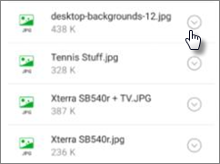
  
4. ייתכן שתתבקש לאפשר ל- Outlook לגשת לתמונות, למדיה ולקבצים במכשיר שלך. הקש על **אפשר**.You may be prompted to allow Outlook to access photos, media, and files on your device. Tap **Allow**.
    
5. בחלק התחתון של המסך, בחר **שמור במכשיר** ולאחר מכן פתח את האפליקציה **גלריה**.At the bottom of the screen, choose to **Save to Device** and then open the **Gallery** app. 
    
6. אתה אמור לראות תמונה מוצפנת (או יותר, אם שמרת קבצים מצורפים מרובים של תמונות) ברשימה. היא עשויה להופיע ברשימת התמונות כריבוע אפור עם סימן קריאה לבן בתוך עיגול לבן, במרכז הריבוע האפור.You should see an encrypted photo (or more, if you saved multiple image file attachments) in the list. It may appear in the Pictures list as a gray square with a white exclamation point within a white circle in the center of the gray square.
    
    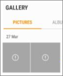
  
## iOSiOS
  
### בדיקה שהגדרות הגנה על יישומים פועלות במכשירי המשתמשיםCheck that the App protection settings are working on user devices

לאחר [קביעת תצורות של יישומים עבור מכשירי iOS](app-protection-settings-for-android-and-ios.md) כדי להגן על יישומים, ניתן לבצע את השלבים הבאים כדי לאמת שההגדרות שבחרת פועלות.After you [set app configurations for iOS devices](app-protection-settings-for-android-and-ios.md) to protect apps, you can follow these steps to validate that the settings you chose work. 
  
ראשית, ודא שהמדיניות חלה על היישום שבו אתה עומד לאמת אותו.First, make sure that the policy applies to the app in which you're going to validate it.
  
1. ב[מרכז הניהול](https://portal.office.com) של Microsoft 365 Business, עבור אל **פריטי מדיניות** \> **ערוך מדיניות**.In the Microsoft 365 Business [admin center](https://portal.office.com), go to **Policies** \> **Edit policy**.
    
2. בחר **מדיניות יישום עבור iOS** עבור ההגדרות שיצרת בתוכנית ההתקנה, או מדיניות אחרת שיצרת וודא שהיא נאכפת עבור Outlook לדוגמה.Choose **Application policy for iOS** for the settings you created at setup, or another policy you created, and verify that it's enforced for Outlook for example. 
    
    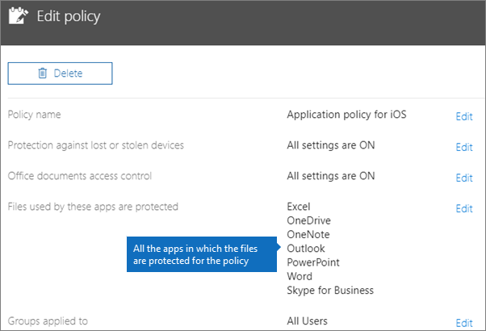
  
### אימות של 'דרוש מספר זיהוי אישי כדי לגשת ליישומי Office'Validate Require a PIN to access Office apps

בחלונית **ערוך מדיניות**, בחר **ערוך** לצד **בקרת גישה למסמכי Office**, הרחב את **קבע כיצד משתמשים ניגשים לקבצי Office במכשירים ניידים**, וודא שהאפשרות **דרוש מספר זיהוי אישי או טביעת אצבע כדי לגשת ליישומי Office** מוגדרת ל **מופעל**.In the **Edit policy** pane, choose **Edit** next to **Office documents access control**, expand **Manage how users access Office files on mobile devices**, and make sure that **Require a PIN or fingerprint to access Office apps** is set to **On**.
  

  
1. במכשיר ה- iOS של המשתמש, פתח את Outlook והיכנס באמצעות אישורי Microsoft 365 Business של המשתמש.In the user's iOS device, open Outlook and sign in with the user's Microsoft 365 Business credentials.
    
2. תתבקש גם להזין PIN או להשתמש בטביעת אצבע.You'll also be prompted to enter a PIN or use a fingerprint.
    
    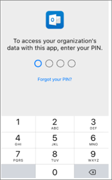
  
### אימות של 'אפס מספר זיהוי אישי כשהכניסה נכשלת מספר פעמים זה'Validate Reset PIN after number of failed attempts

בחלונית ' **עריכת מדיניות** ', בחר ' **עריכה** ' לצד **בקרת גישה למסמכי Office**, הרחב את **ניהול האופן שבו משתמשים ניגשים לקבצי OFFICE בהתקנים ניידים**וודא **שפין איפוס לאחר מספר הנסיונות הכושלים** מוגדר כמספר מסוים.In the **Edit policy** pane, choose **Edit** next to **Office documents access control**, expand **Manage how users access Office files on mobile devices**, and make sure that **Reset PIN after number of failed attempts** is set to some number. . זה 5 כברירת מחדלThis is 5 by default. 
  
1. במכשיר ה- iOS של המשתמש, פתח את Outlook והיכנס באמצעות אישורי Microsoft 365 Business של המשתמש.In the user's iOS device, open Outlook and sign in with the user's Microsoft 365 Business credentials.
    
2. הזן מספר זיהוי אישי שגוי כמספר הפעמים שצוין על-ידי המדיניות.Enter an incorrect PIN as many times as specified by the policy. תראה הודעה שמציינת את **מגבלת ניסיון של pin הושגה** כדי לאפס את ה-PIN.You'll see a prompt that states **PIN Attempt Limit Reached** to reset the PIN. 
    
    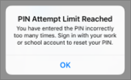
  
3. לחץ על **אישור**.Press **OK**. תתבקש להיכנס עם האישורים העסקיים של Microsoft 365 של המשתמש ולאחר מכן להגדיר PIN חדש.You'll be prompted to sign in with the user's Microsoft 365 Business credentials, and then required to set a new PIN.
    
### אימות של 'כפה על משתמשים לשמור את כל קבצי העבודה ב- OneDrive for Business'Validate Force users to save all work files to OneDrive for Business

בחלונית **ערוך מדיניות**, בחר **ערוך** לצד **הגנה מפני מכשירים שאבדו או נגנבו**, הרחב את **הגן על קבצי עבודה כאשר מכשירים אובדים או נגנבים**, וודא שהאפשרות **כפה על משתמשים לשמור את כל קבצי העבודה ב- OneDrive for Business** מוגדרת ל **מופעל**.In the **Edit policy** pane, choose **Edit** next to **Protection against lost or stolen devices**, expand **Protect work files when devices are lost or stolen**, and make sure that **Force users to save all work files to OneDrive for Business** is set to **On**.
  

  
1. במכשיר ה- iOS של המשתמש, פתח את Outlook והיכנס באמצעות אישורי Microsoft 365 Business של המשתמש והזן קוד זיהוי אישי במידת הצורך.In the user's iOS device, open Outlook and sign in with the user's Microsoft 365 Business credentials, and enter a PIN if requested.
    
2. פתח הודעת דואר אלקטרוני המכילה קובץ מצורף, פתח את הקובץ המצורף ובחר **שמור** בתחתית המסך.Open an email that contains an attachment, open the attachment and choose **Save** on the bottom of the screen. 
    
    
  
3. אתה אמור לראות אפשרות רק עבור OneDrive for Business.You should only see an option for OneDrive for Business. אם לא, הקש על **הוסף חשבון** ובחר **בכונן Onedrive עבור עסקים** מהמסך **הוספת חשבון אחסון** .If not, tap **Add Account** and select **OneDrive for Business** from the **Add Storage Account** screen. ספק את Microsoft 365 Business של משתמש הקצה כדי להיכנס כאשר תתבקש לעשות זאת.Provide the end user's Microsoft 365 Business to sign in when prompted. 
    
    הקש על **שמור** ובחר **OneDrive for Business**.Tap **Save** and select **OneDrive for Business**.
    
### אימות של 'דרוש מהמשתמשים להיכנס שוב לאחר שיישומי Office היו לא פעילים במשך'Validate Require user to sign in again if Office apps have been idle for a specified time

בחלונית **המדיניות edit** , בחר באפשרות **ערוך** לצד **בקרת גישה למסמכי Office**, הרחב את **ניהול האופן שבו משתמשים ניגשים לקבצי Office בהתקנים ניידים**וודא **שדרוש למשתמשים להיכנס שוב לאחר שיישומי office לא היו במצב פעיל** מוגדר כמספר דקות מסוים.In the **Edit policy** pane, choose **Edit** next to **Office documents access control**, expand **Manage how users access Office files on mobile devices**, and make sure that **Require users to sign in again after Office apps have been idle for** is set to some number of minutes. . זה 30 דקות כברירת מחדלThis is 30 minutes by default. 
  
1. במכשיר ה- iOS של המשתמש, פתח את Outlook והיכנס באמצעות אישורי Microsoft 365 Business של המשתמש והזן קוד זיהוי אישי במידת הצורך.In the user's iOS device, open Outlook and sign in with the user's Microsoft 365 Business credentials, and enter a PIN if requested.
    
2. כעת אתה אמור לראות את תיבת הדואר הנכנס של Outlook. הנח למכשיר ה- iOS ואל תיגע בו במשך 30 דקות לפחות (או פרק זמן אחר, ארוך יותר מזה שצוין במדיניות). סביר להניח שהמכשיר יהפוך למעומעם.You should now see Outlook's inbox. Let the iOS device untouched for at least 30 minutes (or some other amount of time, longer than what you specified in the policy). The device will likely dim.
    
3. גישה ל-Outlook בהתקן iOS שוב.Access Outlook on the iOS device again.
    
4. תתבקש להזין את ה-PIN שלך לפני שתוכל לגשת שוב ל-Outlook.You'll be prompted to enter your PIN before you can access Outlook again.
    
### אימות של 'הגן על קבצי עבודה באמצעות הצפנה'Validate Protect work files with encryption

בחלונית **ערוך מדיניות**, בחר **ערוך** לצד **הגנה מפני מכשירים שאבדו או נגנבו**, הרחב את **הגן על קבצי עבודה כאשר מכשירים אובדים או נגנבים**, וודא שהאפשרות **הגן על קבצי עבודה באמצעות הצפנה** מוגדרת ל **מופעל** והאפשרות **כפה על משתמשים לשמור את כל קבצי העבודה ב- OneDrive for Business** מוגדרת ל **מבוטל**.In the **Edit policy** pane, choose **Edit** next to **Protection against lost or stolen devices**, expand **Protect work files when devices are lost or stolen**, and make sure that **Protect work files with encryption** is set to **On**, and **Force users to save all work files to OneDrive for Business** is set to **Off**.
  
1. במכשיר ה- iOS של המשתמש, פתח את Outlook והיכנס באמצעות אישורי Microsoft 365 Business של המשתמש והזן קוד זיהוי אישי במידת הצורך.In the user's iOS device, open Outlook and sign in with the user's Microsoft 365 Business credentials, and enter a PIN if requested.
    
2. פתח דואר אלקטרוני המכיל קבצים מצורפים אחדים של קובץ תמונה.Open an email that contains a few image file attachments.
    
3. הקש על הקובץ המצורף ולאחר מכן הקש על האפשרות **שמור** מתחתיו.Tap the attachment and then tap the **Save** option under it. 
    
4. פתח את היישום **תמונות** מתוך מסך הבית. אתה אמור לראות תמונה מוצפנת (או יותר, אם שמרת קבצים מצורפים מרובים של תמונות) שמורה, אך מוצפנת.Open **Photos** app from the home screen. You should see an encrypted photo (or more, if you saved multiple image file attachments) saved, but encrypted. 
    
---

