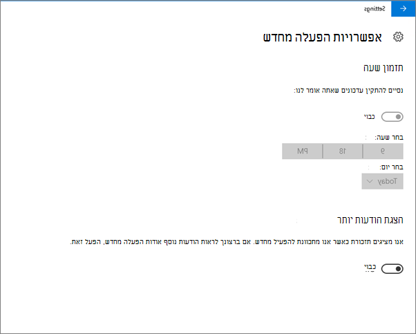
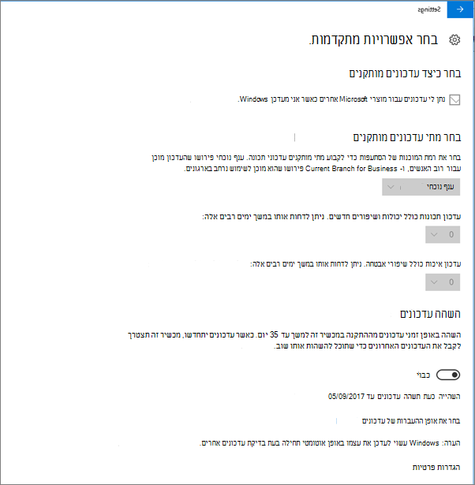
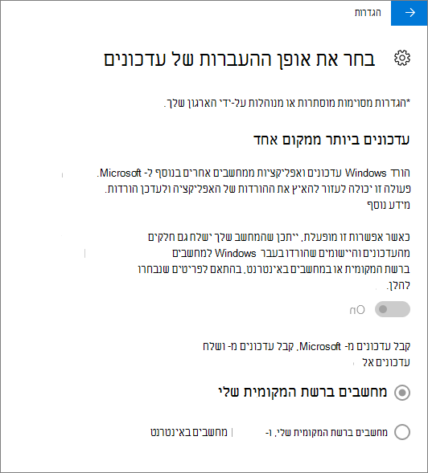
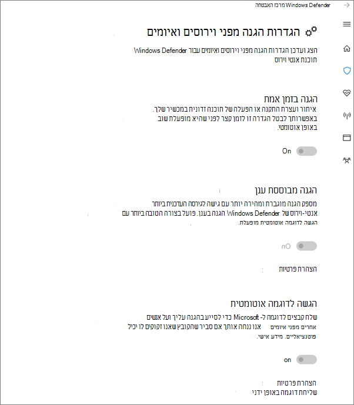

# אימות הגדרות הגנה על מכשיר עבור Windows 10 אישייםValidate device protection settings for Windows 10 PCs

## ודא שמדיניות Windows 10 מוגדרתVerify that Windows 10 device policies are set

לאחר הגדרת [מדיניות מכשירים,](protection-settings-for-windows-10-pcs.md)ייתכן שיקח עד כמה שעות עד שהמדיניות תיתוקף במכשירים של המשתמשים.After you [set up devices policies](protection-settings-for-windows-10-pcs.md), it may take up to a few hours for the policy to take effect on users' devices. באפשרותך לאשר שמדיניות זו השפיעה על-ידי Windows הגדרות שונים במכשירים של המשתמשים.You can confirm that the policies took effect by looking at various Windows Settings screens on the users' devices. מאחר שהמשתמשים לא יוכלו לשנות את הגדרות Windows עדכון אנטי-וירוס של Windows Defender במכשירי Windows 10 שלהם, אפשרויות רבות יהיו באפור.Because the users won't be able to modify the Windows Update and Windows Defender Antivirus settings on their Windows 10 devices, many options will be grayed out.
  
1. עבור אל **הגדרות** \> **עדכון אבטחה &amp; Windows** \> **אפשרויות עדכון** \> **מחדש ואשר** שכל ההגדרות מופיעות באפור.Go to **Settings** \> **Update &amp; security** \> **Windows Update** \> **Restart options** and confirm that all settings are grayed out. 
    
    
  
2. עבור אל **הגדרות** \> **עדכון &amp; אבטחה** Windows \> **אפשרויות** מתקדמות \> **ואשר** שכל ההגדרות מופיעות באפור.Go to **Settings** \> **Update &amp; security** \> **Windows Update** \> **Advanced options** and confirm that all settings are grayed out. 
    
    
  
3. עבור אל **הגדרות** \> **עדכון אבטחה &amp; Windows** \> **אפשרויות מתקדמות** \> **בחר** כיצד \> **ישלחו עדכונים**.Go to **Settings** \> **Update &amp; security** \> **Windows Update** \> **Advanced options** \> **Choose how updates are delivered**.
    
    אשר כי באפשרותך לראות את ההודעה (באדום) שהגדרות מסוימות מוסתרות או מנוהלות על-ידי הארגון שלך, וכל האפשרויות מופיעות באפור.Confirm that you can see the message (in red) that some settings are hidden or managed by your organization, and all the options are grayed out.
    
    
  
4. כדי לפתוח את מרכז Windows Defender אבטחה, עבור **אל הגדרות** עדכון אבטחה Windows Defender לחץ על פתח את Windows Defender אבטחה מרכז האבטחה הגנה מפני הליכי משנה של \> **&amp;** \>  \>  \> **&amp;** \> **&amp; וירוסים הגדרות הגנה מפני איומים.**To open the Windows Defender Security Center, go to **Settings** \> **Update &amp; security** \> **Windows Defender** \> click **Open Windows Defender Security Center** \> **Virus &amp; thread protection** \> **Virus &amp; threat protection settings**. 
    
5. ודא שכל האפשרויות מופיעות באפור.Verify that all options are grayed out. 
    
    
  
## נושאים קשוריםRelated Topics

[Microsoft 365 עבור תיעוד ומשאבים עסקייםMicrosoft 365 for business documentation and resources](./index.yml)
  
[תחילת העבודה עם Microsoft 365 לעסקיםGet started with Microsoft 365 for business](microsoft-365-business-overview.md)
  
[ניהול Microsoft 365 לעסקיםManage Microsoft 365 for business](manage.md)
  
[קביעת תצורות של מכשירים עבור מחשבי Windows 10Set device configurations for Windows 10 PCs](protection-settings-for-windows-10-pcs.md)
