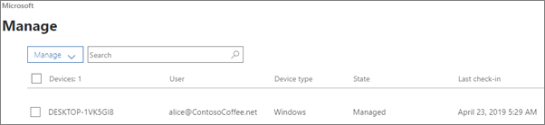

# הצגה וניהול של פריטי מדיניות ומכשיריםView and manage policies and devices

מאמר זה חל על Microsoft 365 Business Premium.This article applies to Microsoft 365 Business Premium.

## הצגה ועריכה של מדיניות מכשירView and edit device policies

1.  עבור אל מרכז הניהול <a href="https://go.microsoft.com/fwlink/p/?linkid=837890" target="_blank">https://admin.microsoft.com</a> ב- .Go to the admin center at <a href="https://go.microsoft.com/fwlink/p/?linkid=837890" target="_blank">https://admin.microsoft.com</a>.
2. בסרגל הניווט הימני, בחר **מדיניות** \> **מכשירים**.On the left nav, choose **Devices** \> **Policies**.

    בדף זה, באפשרותך ליצור, לערוך, לשנות קבוצת יעד או למחוק מדיניות.On this page, you can create, edit, change target group, or delete a policy.

    
  
## הצגה וניהול של מכשיריםView and manage devices

1. בסרגל הניווט הימני, בחר **מכשירים** \> **ניהול**.On the left nav, choose **Devices** \> **Manage**. 
    
    בדף זה, באפשרותך לבחור מכשיר אחד או יותר ולהסיר נתוני חברה.On this page, you can select one or more devices and remove company data. עבור מכשירי Windows 10 שקבעת עבורם הגדרות של הגנה על מכשיר, באפשרותך גם לאפס את המכשיר להגדרות היצרן.For Windows 10 devices that you have set device protections settings for, you can also choose to reset the device to factory settings.
  
   

