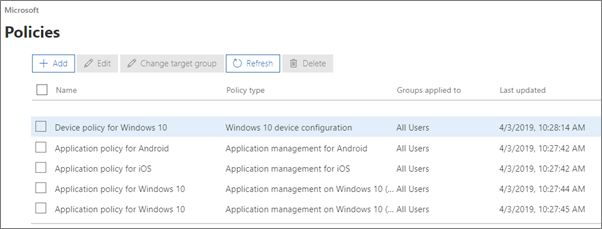

# הצגה וניהול של מדיניות והתקניםView and manage policies and devices

מאמר זה חל על 365 עסקים Premium של Microsoft.This article applies to Microsoft 365 Business Premium.

## הצגה ועריכה של מדיניות התקניםView and edit device policies

1.  . לך למרכז המנהלה https://admin.microsoft.comGo to the admin center at <a href="https://go.microsoft.com/fwlink/p/?linkid=837890" target="_blank">https://admin.microsoft.com</a>.
2. בניווט השמאלי, בחר **Devices** \> **בפריטי מדיניות**של התקנים.On the left nav, choose **Devices** \> **Policies**.

    בדף זה, באפשרותך ליצור, לערוך, לשנות קבוצת יעד או למחוק מדיניות.On this page, you can create, edit, change target group, or delete a policy.

    
  
## הצג ונהל התקניםView and manage devices

1. בניווט השמאלי, בחר באפשרות ' **התקנים** ' \> **Manage**.On the left nav, choose **Devices** \> **Manage**. 
    
    בדף זה, באפשרותך לבחור התקן אחד או יותר ולהסיר נתוני חברה.On this page, you can select one or more devices and remove company data. עבור מכשירי Windows 10 שקבעת עבורם הגדרות של הגנה על מכשיר, באפשרותך גם לאפס את המכשיר להגדרות היצרן.For Windows 10 devices that you have set device protections settings for, you can also choose to reset the device to factory settings.
  
   

